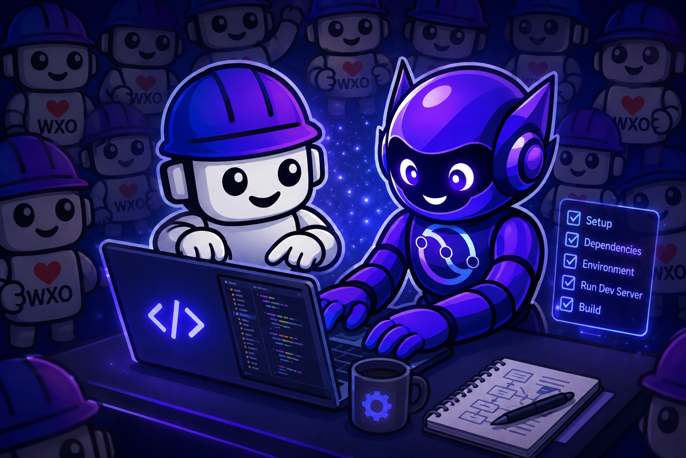
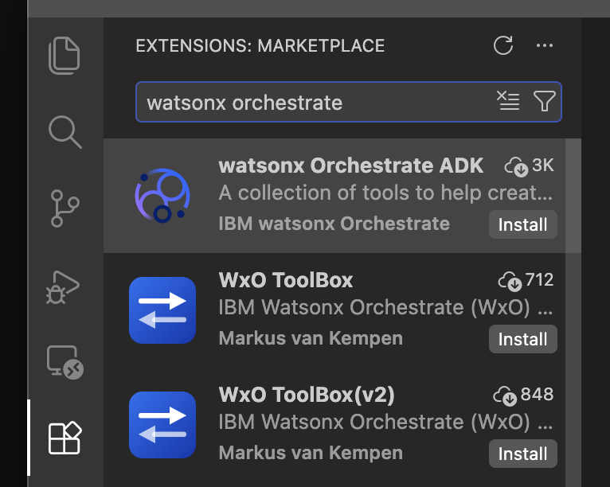
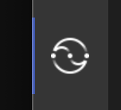

# Part 0: Setup & Environment

<p align="center">
  
</p>

**Duration:** 15–20 minutes**Objective:** Get your development environment ready for building advanced watsonx Orchestrate agents

---

## Prerequisites Check

Before starting, ensure you have:

- [ ] Python 3.11–3.13 installed
- [ ] `uv` installed
- [ ] IBM Bob IDE installed
- [ ] watsonx Orchestrate SaaS access (your instructor will provide credentials)
- [ ] A Groq API key (free — sign up at [console.groq.com](https://console.groq.com)) — needed for Part 1
- [ ] A News API key (free — sign up at [newsapi.org](https://newsapi.org)) — needed for Part 1

---

## Step 1: Verify Python Installation

Open a terminal and run:

```bash
python --version
# or
python3 --version
```

You need Python **3.11, 3.12, or 3.13**. If Python is not installed:

=== "Mac"
    ```bash
    # Using Homebrew (recommended)
    brew install python@3.11

    # Or download the installer from:
    # https://www.python.org/downloads/
    ```

=== "Windows"
    ```powershell
    # Using winget
    winget install Python.Python.3.11

    # Or download the installer from:
    # https://www.python.org/downloads/
    # ⚠️ Check "Add Python to PATH" during installation
    ```

---

## Step 2: Verify uv Installation

```bash
uv --version
```

If `uv` is not installed:

=== "Mac"
    ```bash
    # Using Homebrew
    brew install uv

    # Or using the official installer
    curl -LsSf https://astral.sh/uv/install.sh | sh
    ```

=== "Windows"
    ```powershell
    # Using winget
    winget install astral-sh.uv

    # Or using the official installer (PowerShell)
    powershell -ExecutionPolicy ByPass -c "irm https://astral.sh/uv/install.ps1 | iex"
    ```

After installing, open a new terminal and run `uv --version` again to confirm.

---

## Step 3: Download and Extract the Workshop Folder

The Bob config zip *is* your workspace folder — extracting it creates `bobchestrate-advanced/` with the `.bob/` configuration already in place. No need to create a folder manually.

1. Download the zip:

   - Navigate to: [`advanced/part0-setup/bobchestrate-advanced.zip`](https://github.com/juseljuk/bobchestrate-workshop/raw/main/advanced/part0-setup/bobchestrate-advanced.zip)
   - Click **Download raw file** (or use the direct link above)
2. Extract it — **extract to your Desktop or a convenient location, not inside an existing folder**:

   **Mac/Linux:**

   ```bash
   cd ~/Desktop
   unzip ~/Downloads/bobchestrate-advanced.zip
   # This creates: ~/Desktop/bobchestrate-advanced/
   ```

   **Windows (PowerShell):**

   ```powershell
   cd $env:USERPROFILE\Desktop
   Expand-Archive -Path "$env:USERPROFILE\Downloads\bobchestrate-advanced.zip" -DestinationPath .
   # This creates: Desktop\bobchestrate-advanced\
   ```

   After extracting, your `bobchestrate-advanced/` folder already contains:

   ```
   bobchestrate-advanced/
   └── .bob/
       ├── mcp.json
       ├── custom_modes.yaml
       ├── rules/
       │   └── wxo-dev-rule-enhanced.md
       └── skills/
           └── wxo-langgraph/
   ```

> **Note:** The `.bob` folder may be hidden in your file explorer (it starts with a dot). That's expected — Bob IDE will find it automatically.

**What the bundle gives you:**

| Component                                             | What it does                                                                                                                                                                                                          |
| ----------------------------------------------------- | --------------------------------------------------------------------------------------------------------------------------------------------------------------------------------------------------------------------- |
| **WXO Agent Architect mode**                    | A Bob chat mode specialised for watsonx Orchestrate development — automatically consults live wxO docs before answering and uses the ADK MCP server to inspect your environment                                      |
| **`wxo-dev-rule-enhanced`**                   | A workspace rule that loads IBM watsonx Orchestrate best practices into every Bob response — correct naming conventions, tool patterns, agent YAML structure, connection setup, and more                             |
| **`watsonx-orchestrate-adk` MCP server**      | Gives Bob direct access to your wxO environment — list agents, tools, connections, import artifacts, and chat with agents without leaving the IDE                                                                    |
| **`watsonx-orchestrate-adk-docs` MCP server** | Gives Bob real-time access to the full IBM watsonx Orchestrate ADK documentation — Bob searches it automatically when it needs to verify platform specifics                                                          |
| **`wxo-langgraph` skill**                     | Deep LangGraph-for-wxO knowledge: entry point contract, platform constraints, credential patterns, checkpointers, cross-session memory API, and a troubleshooting reference — auto-activates when you work on Part 1 |

These three layers work together and complement each other:

- **Mode** — sets Bob's *persona and behaviour* for a session. The WXO Agent Architect mode tells Bob to think like a watsonx Orchestrate developer: consult the docs first, use the ADK MCP tools to inspect your live environment, and never add `ibm-watsonx-orchestrate` to `requirements.txt`. It's the "who Bob is" layer.
- **Custom rule** — sets *always-on constraints* that apply to every response regardless of mode or topic. The `wxo-dev-rule-enhanced` rule enforces platform conventions (snake_case agent names, correct decorator imports, `key_value` connections, evaluation config format, etc.) so Bob never generates code that violates wxO best practices — even if you're chatting in a generic mode.
- **Skill** — provides *deep, topic-specific knowledge* that Bob loads on demand. The `wxo-langgraph` skill is a compact reference covering every LangGraph-for-wxO pattern: the `create_agent` contract, platform constraints, credentials, checkpointers, memory API, and common errors. It activates automatically when the topic matches, so Bob answers LangGraph questions with platform-correct detail without you having to ask it to "remember the rules".

Together: the **mode** shapes how Bob approaches problems, the **rule** keeps every answer platform-safe, and the **skill** supplies the deep domain knowledge for the specific topic you're working on.

---

## Step 4: Open IBM Bob IDE and Login

> **Download IBM Bob IDE:** If you haven't installed it yet, download from [bob.ibm.com/download](https://bob.ibm.com/download)
> **Detailed install guide:** [bob.ibm.com/docs/ide/getting-started/install](https://bob.ibm.com/docs/ide/getting-started/install)

Open Bob IDE and sign in with your IBM ID.

> ⚠️ **You must be logged in to use Bob's AI capabilities throughout the workshop.** If you encounter login issues, contact your instructor.

---

## Step 5: Open Your Workshop Folder in Bob IDE

1. In Bob IDE, click **File** → **Open Folder**
2. Navigate to the extracted `bobchestrate-advanced` folder and click **Open**
3. Click **Yes, I trust the author** when prompted

The workspace will open with the `.bob/` configuration already in place.

---

## Step 6: Create a Python Virtual Environment

1. Open the Command Palette (`Cmd+Shift+P` / `Ctrl+Shift+P`)
2. Type **"Python: Create Environment"** and select it
3. Choose **Venv**
4. Select Python 3.11, 3.12, or 3.13
5. Wait for the environment to be created

You'll see a `.venv` folder appear in your workspace. Bob IDE automatically activates it in all new terminals (you'll see `(.venv)` in your terminal prompt).

---

## Step 7: Install the watsonx Orchestrate ADK VS Code Extension

> ⚠️ **If you already have the extension installed**, please reload the Bob IDE window first! This ensures the extension properly detects your new virtual environment. Open the Command Palette (`Cmd+Shift+P` on Mac / `Ctrl+Shift+P` on Windows/Linux), type **"Developer: Reload Window"** and select it. The Bob IDE window reloads and the extension will restart. You can then proceed directly to Step 8. Do **NOT** use the extension to initialise the workspace!

Install the watsonx Orchestrate extension for IBM Bob IDE:

1. Open the Extensions view in IBM Bob IDE (click the Extensions icon in the Activity Bar or press `Cmd+Shift+X` on Mac / `Ctrl+Shift+X` on Windows/Linux)

   
2. Search for **"watsonx Orchestrate"**

   
3. Click **Install** on the **"watsonx Orchestrate ADK"** extension
4. Wait for the installation to complete
5. Reload Bob IDE if prompted
6. You should now see the extension icon appear in the Activity Bar — you do **NOT** need to open it. If you do, do **NOT** initialize the workspace using it, as this can cause issues with the setup procedure:

   

The IBM watsonx Orchestrate ADK VS Code extension provides:

- **Workspace Management** — automatically creates and initializes folder structures for agent development
- **ADK Version Management** — install and update the watsonx Orchestrate ADK directly from VS Code
- **Agent & Tool File Creation** — assists with creating agent and tool files
- **Developer Edition Server Control** — start/stop the watsonx Orchestrate Developer Edition server from the UI
- **Orchestrate AI Builder Assistant** — interactive AI assistant for building and refining agents

> ⚠️ Do **NOT** open the extension itself — you just need it installed. Using the extension to initialise the workspace can cause issues!

---

## Step 8: Install the watsonx Orchestrate SDK

1. Look at the status bar at the bottom of Bob IDE — you should see a red ❌ indicating the ADK is not installed in your new virtual environment
2. Click the red ❌
3. Select the option to install the ADK
4. Wait for installation to complete — the status bar will show a green ✅ with the version number

---

## Step 9: Check that watsonx Orchestrate MCP servers and the WXO Agent Architect mode are available

As explained in Step 3, the zip file / extracted workspace directory already includes the needed MCP server and mode definitions. Now, let's test that they are registered correctly and Bob can use them.

1. **Verify the MCP servers are running:**
2. Open Bob's chat panel and select **Agent** or **Ask** mode
3. Ask Bob: `"What MCP servers are available?"`
4. You should see both listed:

   - `watsonx-orchestrate-adk` — tools for interacting with watsonx Orchestrate
   - `watsonx-orchestrate-adk-docs` — watsonx Orchestrate documentation

**Verify the WXO Agent Architect mode is available:**

1. Click the mode selector in Bob's chat panel
2. You should see **WXO Agent Architect** in the list
3. Select it — ask Bob: `"What can you help me with in this mode?"`
4. You should see the main topics listed

**Verify that the custom development rule is also active:**

1. Keep the **WXO Agent Architect** mode selected
2. Ask Bob: `"What custom rules you can use and have access to?"`
3. You should see the topics from the **wxo-dev-rule-ehanced.md** listed

---

## Step 10: Connect to Your watsonx Orchestrate Environment

You need your watsonx Orchestrate **API key** and **instance URL**. Your instructor will provide these. If you're using your own instance, follow the optional section below.

### OPTIONAL: Using your own watsonx Orchestrate SaaS instance

**To get your API key:**

1. In the wxO console, click your **profile icon** (top-right)
2. Select **Settings** → **API details**
3. Click **Generate API key**, then **Copy** immediately
4. Store it securely — it is shown only once

**To get your instance URL:**
Copy the **Service instance URL** from the API details page.

### Configure the ADK Environment

#### Option A: Using the ADK CLI

Open a terminal in Bob IDE (**Terminal** → **New Terminal**) and run:

```bash
# Add your environment
orchestrate env add -n my-advanced-wxo -u <your-api-url>

# Activate it
orchestrate env activate my-advanced-wxo -a <your-api-key>
```

You should see: `[INFO] Environment 'my-advanced-wxo' is now active`

> ⚠️ **Authentication expires every two hours.** When it expires, re-run `orchestrate env activate` with your API key. Keep your API key handy.

#### Option B: Using Bob

1. Make sure **WXO Agent Architect** mode is selected in Bob's chat
2. Ask Bob:
   ```
   Create a simple shell script to add and activate a new watsonx Orchestrate SaaS environment for the ADK. I have the environment URL and API key ready.
   ```
3. Follow Bob's steps — it will create and run a script that sets up your environment

**Verify the connection:**

```bash
orchestrate agents list
```

If configured correctly, this lists any existing agents (or shows an empty list if none exist yet). Any output without an error means you're connected.

---

## Step 11: Get Your Part 1 API Keys

Part 1 (LangGraph Agents) uses two external APIs. Get your free keys now so you have them ready.

### Groq API Key

Used to run LLMs (Llama 3) for free via Groq's API.

1. Go to [console.groq.com](https://console.groq.com)
2. Sign up for a free account
3. Navigate to **API Keys** → **Create API Key**
4. Copy and save your key — it starts with `gsk_`

### News API Key

Used by the `research_agent` to fetch live news headlines.

1. Go to [newsapi.org](https://newsapi.org)
2. Click **Get API Key** (free tier)
3. Register and copy your key

> You'll set these as environment variables when running `import-all.sh` in Part 1:
>
> ```bash
> export GROQ_API_KEY=gsk_your_key_here
> export NEWS_API_KEY=your_news_key_here
> ```

---

## Step 12: Understand the Advanced Workshop Structure

After completing setup, your workspace will look like this:

```
bobchestrate-advanced/
├── .bob/                               # Bob IDE configuration (from bundle)
│   ├── mcp.json                        # MCP server config
│   ├── custom_modes.yaml               # WXO Agent Architect mode
│   ├── rules/
│   │   └── wxo-dev-rule-enhanced.md    # wxO dev rule (loaded automatically)
│   └── skills/
│       └── wxo-langgraph/              # LangGraph skill (auto-activates in Part 1)
│           ├── SKILL.md
│           ├── constraints.md
│           ├── patterns/
│           └── ref/
└── .venv/                              # Python virtual environment
```

When you work through Part 1, your agent code will live in subfolders you create (e.g. `agents/echo_agent/`, `agents/research_agent/`). The lab guide tells you exactly where to put each file.

---

## Using Bob in the Advanced Workshop

Bob is your AI pair programmer. With the bundle installed, Bob has:

- **WXO Agent Architect mode** — specialised for building wxO agents, with access to live wxO docs
- **`wxo-langgraph` skill** — deep knowledge of LangGraph-for-wxO patterns, constraints, credentials, memory, and common errors. Auto-activates when you ask LangGraph questions.
- **`wxo-dev-rule-enhanced`** — platform best-practices loaded as a workspace rule

### Effective Bob prompts for the advanced workshop:

✅ `"Bob, help me build a LangGraph agent that calls the Groq API using a wxO connection"`
✅ `"Bob, my agent import is failing — here's the error: [paste error]"`
✅ `"Bob, what's the correct way to add a checkpointer to a LangGraph agent on wxO?"`
✅ `"Bob, show me the minimal agent.yaml structure for a LangGraph package import"`

### Less effective:

❌ `"Bob, fix this"` — too vague
❌ `"Bob, make it work"` — no context

### Managing Bob sessions:

- **Continue the same session** when working on the same agent or related tasks
- **Start a new task** (click "Start New Task" in Bob's chat) when switching to a completely different topic

---

## Troubleshooting

### Issue: `orchestrate: command not found`

The SDK isn't installed or isn't in your PATH. Make sure your virtual environment is active and try reinstalling:

```bash
pip install ibm-watsonx-orchestrate
```

### Issue: `Authentication failed` or `401 Unauthorized`

Your wxO session has expired (sessions last 2 hours). Re-activate:

```bash
orchestrate env activate my-advanced-wxo -a <your-api-key>
```

### Issue: Bob isn't responding or MCP servers show red

1. Check the MCP server status via Command Palette → "MCP Servers"
2. If servers show red, re-run "watsonx Orchestrate: Install WXO MCP Servers"
3. If Bob is unresponsive, restart Bob IDE

### Issue: `.bob` folder not found / WXO Agent Architect mode missing

The `.bob` folder needs to be at the root of your open workspace folder. Check:

```bash
ls -la bobchestrate-advanced/
# You should see: .bob/  .venv/
```

If missing, redo Step 3 (re-extract the zip into a fresh location).

---

## Quick Reference

```bash
# Check ADK version
orchestrate --version

# Add wxO environment
orchestrate env add -n my-advanced-wxo -u <api-url>

# Activate wxO environment (re-run every 2 hours)
orchestrate env activate my-advanced-wxo -a <api-key>

# List active environments
orchestrate env list

# List agents
orchestrate agents list

# Import a LangGraph agent
orchestrate agents import \
  --package-root agents/my_agent \
  --config-file agents/my_agent/agent.yaml

# List tools
orchestrate tools list

# List connections
orchestrate connections list

# Get help
orchestrate --help
```

---

## Next Steps

Once your setup is verified:

- [ ] `orchestrate agents list` returns without error
- [ ] Bob responds and shows WXO Agent Architect mode
- [ ] MCP servers show green in the MCP Servers panel
- [ ] You have your Groq and News API keys ready

**You're ready for the first advanced lab!**

Continue to → [Part 1: Building Custom LangGraph Agents](../part1-langgraph/README.md)

---

## Additional Resources

- [IBM watsonx Orchestrate ADK Documentation](https://developer.watson-orchestrate.ibm.com/)
- [LangGraph Documentation](https://langchain-ai.github.io/langgraph/)
- [IBM Bob IDE Documentation](https://bob.ibm.com/docs)
- [Groq Console](https://console.groq.com)
- [News API](https://newsapi.org)
