# Advanced Part 2: Event-Driven AI Agents with Confluent Cloud

<p align="center">
  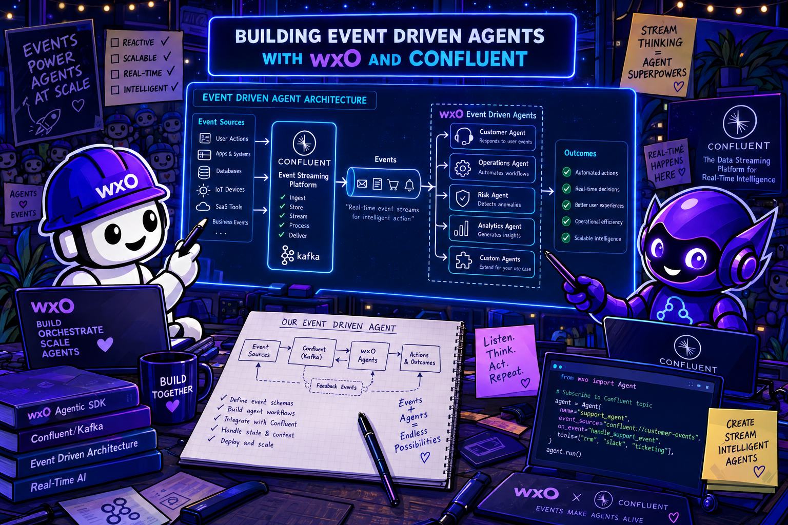
</p>

**Duration:** 75–90 minutes

**Difficulty:** ⭐⭐⭐⭐ Advanced

---

## Prerequisites Check

Before starting, ensure you have:

- [ ] `uv` installed
- [ ] IBM Bob IDE installed
- [ ] watsonx Orchestrate SaaS access (your instructor will provide environment/access information)
- [ ] Confluent Cloud access (your instructor will provide environment/access information)

> **No Python installation required.** The workspace zip ships with a fully pre-configured virtual environment — Python 3.12, all dependencies, and the watsonx Orchestrate ADK are already installed inside it.

### Step 1: Verify uv Installation

`uv` is required because the Bob IDE MCP server for the watsonx Orchestrate ADK is launched via `uvx`. You do **not** need it to install Python packages — the workspace zip ships with everything pre-installed.

```bash
uv --version
```

If `uv` is not installed:

=== "Mac"
    ```bash
    # Using Homebrew
    brew install uv

    # Or using the official installer
    curl -LsSf https://astral.sh/uv/install.sh | sh
    ```

=== "Windows"
    ```powershell
    # Using winget
    winget install astral-sh.uv

    # Or using the official installer (PowerShell)
    powershell -ExecutionPolicy ByPass -c "irm https://astral.sh/uv/install.ps1 | iex"
    ```

After installing, open a new terminal and run `uv --version` again to confirm.

---

## Before You Start — Workspace Setup

This lab uses a **battery-included workspace zip**: it contains the Bob IDE configuration, all pre-built Python scripts, **and a fully pre-configured virtual environment** with Python 3.12, `confluent-kafka`, `python-dotenv`, `jsonschema`, and the complete watsonx Orchestrate ADK (including the `orchestrate` CLI) already installed. **You do not need to run `uv sync`, install packages, or install the ADK manually.**

### What's inside the zip

```
bobchestrate-confluent/
├── .bob/                               # Bob IDE configuration (auto-loaded)
│   ├── custom_modes.yaml               # WXO Agent Architect mode
│   ├── mcp.json                        # ADK + docs MCP servers (uses uvx)
│   ├── rules/
│   │   └── wxo-dev-rule-enhanced.md    # wxO best-practice rule
│   └── skills/
│       └── wxo-langgraph/              # LangGraph skill
├── .venv/                              # Pre-built virtual environment (Python 3.12)
│   └── lib/python3.12/site-packages/   # All dependencies pre-installed:
│       ├── ibm_watsonx_orchestrate/    #   watsonx Orchestrate ADK + orchestrate CLI
│       ├── confluent_kafka/            #   Confluent Kafka client (Avro/JSON/Protobuf)
│       ├── jsonschema/                 #   JSON Schema validation
│       └── python_dotenv/              #   dotenv support
├── .vscode/
│   └── settings.json                   # Bob IDE workspace settings
├── workspace_config.yaml               # wxO ADK workspace configuration
└── retail-inventory-optimization/      # Pre-built lab code and data
    ├── fashion-inventory-consumer/     # Python scripts + .env.example
    ├── fashion-inventory-setup/        # Schemas, Flink SQL, test data
    └── labs/
        ├── part1-confluent-cep/        # Part 1 lab guides and screenshots
        └── part2-watsonx-orchestrate/
            └── inventory-alert-demo-knowledge/   # Knowledge base documents
```

> **Note:** The `.bob` and `.venv` folders may appear hidden in your file explorer — that's expected. Bob IDE and the Python tools find them automatically.

### Step 1: Download the workspace zip

Download [`bobchestrate-confluent.zip`](https://github.com/juseljuk/bobchestrate-workshop/raw/main/advanced/part2-confluent/bobchestrate-confluent.zip) and save it to your Downloads folder.

### Step 2: Extract the zip

**Mac/Linux:**

```bash
cd ~/Desktop
unzip ~/Downloads/bobchestrate-confluent.zip
# This creates: ~/Desktop/bobchestrate-confluent/
```

**Windows (PowerShell):**

```powershell
cd $env:USERPROFILE\Desktop
Expand-Archive -Path "$env:USERPROFILE\Downloads\bobchestrate-confluent.zip" -DestinationPath .
# This creates: Desktop\bobchestrate-confluent\
```

### Step 3: Open the folder in Bob IDE

1. Open Bob IDE
2. Click **File** → **Open Folder**
3. Navigate to the extracted `bobchestrate-confluent` folder and click **Open**
4. Click **Yes, I trust the author** when prompted

Bob IDE will detect `.bob/` automatically and pick up the pre-built `.venv`. You should see **WXO Agent Architect** available in the mode selector and a green ✅ in the status bar confirming the ADK is ready — no further installation required. **NOTE:** You'll see the ADK status bar ***ONLY*** if you have the watsonx Orchestrate ADK extension installed and available in your workspace - it is not needed for the lab.

> ⚠️ **If the ADK status bar shows a red ❌**, the extension may have selected the wrong Python interpreter. Open the Command Palette (`Cmd+Shift+P` on Mac / `Ctrl+Shift+P` on Windows/Linux), type **"Python: Select Interpreter"**, and choose the one that points to `.venv/bin/python` inside your workspace folder. Then reload the window (**"Developer: Reload Window"**).

### Step 4: Verify your wxO ADK connection

If you haven't connected the ADK to your wxO environment yet, do it now (**NOTE**: your instructor will provide the needed instance URL and API Key):

```bash
orchestrate env add -n confluent-lab -u <your-wxo-instance-url>
orchestrate env activate confluent-lab -a <your-wxo-api-key>
orchestrate agents list
```

Any output (even an empty list) without an error means you're connected.

### ✅ Ready to start when:

- [ ] `bobchestrate-confluent/` is open in Bob IDE and **WXO Agent Architect** mode appears in the mode selector
- [ ] ADK status bar shows a green ✅ (ONLY if you have the watsonx Orchestrate ADK extension installed)
- [ ] `orchestrate agents list` returns without error
- [ ] You have a Confluent Cloud account (will be provided by your instructor)

---

## Overview

This lab teaches you to build an **event-driven AI pipeline** — a pattern where real-time streaming events automatically trigger AI agent analysis. You'll combine two cloud platforms: **Confluent Cloud** for stream processing and **IBM watsonx Orchestrate** for AI-powered decision-making.

The business scenario: a fashion retailer needs to detect when a product is selling abnormally fast and immediately get an AI-driven inventory decision — reorder, surge price, or monitor — before stock runs out.

### What You'll Build

| Component                          | Technology              | What it does                                                         |
| ---------------------------------- | ----------------------- | -------------------------------------------------------------------- |
| **Kafka topics**             | Confluent Cloud         | Carry raw inventory events and velocity alerts                       |
| **Velocity spike detector**  | Flink SQL               | Identifies products selling 3× faster than baseline                 |
| **Python consumer**          | confluent-kafka + httpx | Reads alerts, calls the wxO agent, publishes decisions               |
| **Inventory analysis agent** | watsonx Orchestrate     | Reasons about urgency, recommends actions, outputs schema-valid JSON |
| **Knowledge base**           | wxO KB                  | Gives the agent decision rules, product history, and guardrails      |

All Python code is **pre-built** in `retail-inventory-optimization/`. Your job is to wire it together, configure the platforms, and use Bob to create the agent.

### Why This Pattern Matters

| Use event-driven AI when...                | Use a chat agent when...                  |
| ------------------------------------------ | ----------------------------------------- |
| Events happen continuously and at volume   | A human initiates each request            |
| Decisions must be made in near-real-time   | Response latency of seconds is acceptable |
| AI enrichment feeds a downstream system    | Output is for a human to read             |
| You need audit trails of every AI decision | Conversation context is the primary state |

---

## Using Bob for This Lab

Bob (in **WXO Agent Architect mode**) handles the watsonx Orchestrate side — creating tools, a knowledge base, and the agent. The prompts in Section 4 are written to be copy-pasted directly.

| When you're on…                               | Ask Bob…                                                                                    |
| ---------------------------------------------- | -------------------------------------------------------------------------------------------- |
| **Section 4.2 — Store Location Tool**   | Copy-paste the prompt block provided in the section                                          |
| **Section 4.3 — Weather Forecast Tool** | Copy-paste the prompt block provided in the section                                          |
| **Section 4.5 — Knowledge Base**        | Copy-paste the prompt block provided in the section                                          |
| **Section 4.6 — Agent**                 | Copy-paste the prompt block provided in the section                                          |
| **Section 5 — Consumer config**         | `"Show me which environment variables the orchestrate_client.py needs"`                    |
| **Debugging auth errors**                | `"My WXO_API_KEY is correct but I get 401 — what could cause this?"`                      |
| **Debugging schema validation**          | `"The agent response is failing validation on reasoning — what does the schema require?"` |

---

## Section 0 — What is Event-Driven AI? (5 min)

### The pattern

Traditional AI workflows are **request-response**: a human asks a question, the agent replies. Event-driven AI flips this: an **event in a stream** triggers the agent automatically, with no human in the loop.

```
Traditional:   Human → Agent → Human
Event-driven:  System event → Agent → Downstream system
```

This unlocks AI automation at scale. Inventory spikes, fraud signals, equipment anomalies, sensor readings — any event stream can be enriched with AI reasoning.

### The three roles in this pipeline

**Stream processor (Flink SQL)** — Watches the raw event stream and detects patterns. Stateless, deterministic, fast. Produces structured alerts. Does not make judgment calls.

**AI agent (watsonx Orchestrate)** — Receives a structured alert, reasons about it using knowledge and tools, and returns a structured decision. Slow relative to Flink (seconds), but capable of nuanced judgment.

**Bridge (Python consumer)** — Connects the two worlds. Reads Kafka alerts, calls the agent synchronously, validates the response against a JSON schema, and publishes the enriched result to a new Kafka topic. **NOTE**: *watsonx Orchestrate will have more tighter integration with Confluent including an HTTP sink connector that you can configure as part of the overall pipeline so that in future you do not need to run seperate bridge services.*

### What you learned

- Event-driven AI separates fast pattern detection from slow AI reasoning
- A Python bridge connects streaming infrastructure to an AI agent
- Schema validation at the output boundary is essential for downstream reliability

---

## Section 1 — Architecture Overview (5 min)

```text
┌──────────────────────────────────────────────────────────────────┐
│                     Confluent Cloud                              │
│                                                                  │
│  Python Producer  ──▶  fashion.inventory.events  ──▶  Flink SQL  │
│  (test CSV data)        (raw POS events)              (velocity   │
│                                                        spike      │
│                                                        detector)  │
│                                                          │        │
│                                          fashion.velocity.anomalies
│                                                          │        │
└──────────────────────────────────────────────────────────┼───────┘
                                                           │
                                              Python Consumer reads
                                                           │
                                                           ▼
                                          ┌─────────────────────────┐
                                          │   watsonx Orchestrate   │
                                          │                         │
                                          │  Fashion Inventory      │
                                          │  Alert Processor        │
                                          │                         │
                                          │  Tools:                 │
                                          │  - get_store_location   │
                                          │  - get_weather_forecast │
                                          │                         │
                                          │  Knowledge Base:        │
                                          │  - inventory-alert-     │
                                          │    knowledge            │
                                          └──────────┬──────────────┘
                                                     │
                                          Structured JSON decision
                                                     │
                              ┌──────────────────────▼───────────────┐
                              │  Python Consumer validates + publishes │
                              │  ▶  fashion.agent.responses (Kafka)   │
                              └───────────────────────────────────────┘
```

### Three Kafka topics

| Topic                          | Producer             | Consumer           | Contents              |
| ------------------------------ | -------------------- | ------------------ | --------------------- |
| `fashion.inventory.events`   | Python test producer | Flink SQL          | Raw POS sale events   |
| `fashion.velocity.anomalies` | Flink SQL            | Python consumer    | Velocity spike alerts |
| `fashion.agent.responses`    | Python consumer      | Downstream systems | AI-enriched decisions |

### Key files in `retail-inventory-optimization/`

```text
retail-inventory-optimization/
├── fashion-inventory-consumer/          # Python applications (pre-built)
│   ├── .env.example                     # ← You'll fill this in Section 5
│   ├── produce_inventory_events.py      # Test data producer
│   ├── consume_velocity_alerts.py       # Basic consumer (Section 3)
│   ├── consume_velocity_alerts_with_agent.py  # Agent consumer (Section 6)
│   ├── orchestrate_client.py            # wxO HTTP client + token management
│   ├── agent_payload_builder.py         # Alert → agent request transformer
│   ├── agent_response_producer.py       # Kafka publisher for agent responses
│   └── response_validator.py           # JSON schema validator
│
├── fashion-inventory-setup/
│   ├── schemas/                         # Three JSON schemas
│   │   ├── fashion-inventory-event.schema.json
│   │   ├── velocity-anomaly-alert.schema.json
│   │   └── agent-response.schema.json
│   ├── sql/
│   │   └── velocity_anomaly_detection.sql   # Flink SQL query
│   └── data/
│       ├── test_winter_jacket_spike.csv     # Test data
│       └── store_locations.csv              # Store location data for tool
│
└── labs/part2-watsonx-orchestrate/
    └── inventory-alert-demo-knowledge/  # Knowledge base documents (6 files)
```

---

## Section 2 — Confluent Cloud Setup (15 min)

You need three Kafka topics, JSON schemas registered for each, and a Flink compute pool — all inside a shared Confluent Cloud cluster that has been pre-created for this workshop.

### 2.1 Log in to Confluent Cloud

Your instructor will guide you through logging in to [confluent.cloud](https://confluent.cloud). Once logged in:

1. Select the **`zurich-env`** environment by clicking the tile for it

   <p align="left">
        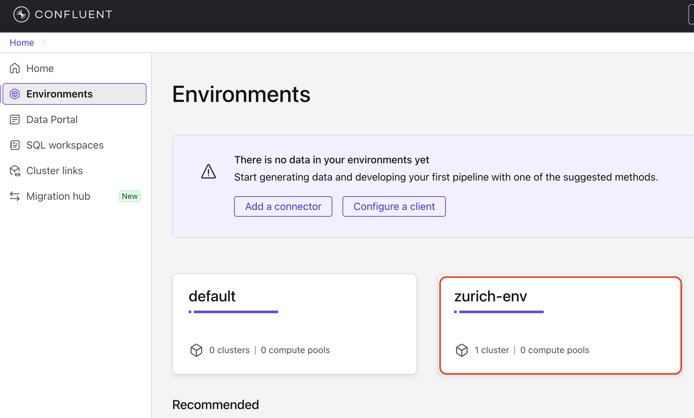
      </p>
2. Open the **`zurich-clu`** cluster by clicking the tile for it

   <p align="left">
        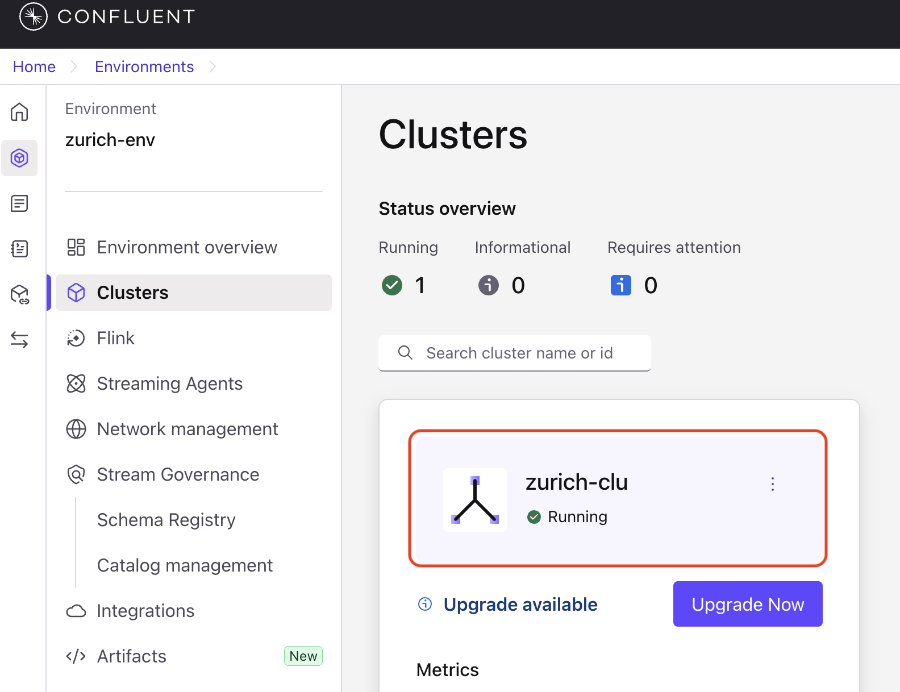
      </p>

> **Do not create a new environment or cluster.** The shared infrastructure is already in place — you only need to create your own topics inside it.

Make a note of the **Bootstrap server URL** from the cluster overview — you'll need it for `.env` later.

<p align="left">
        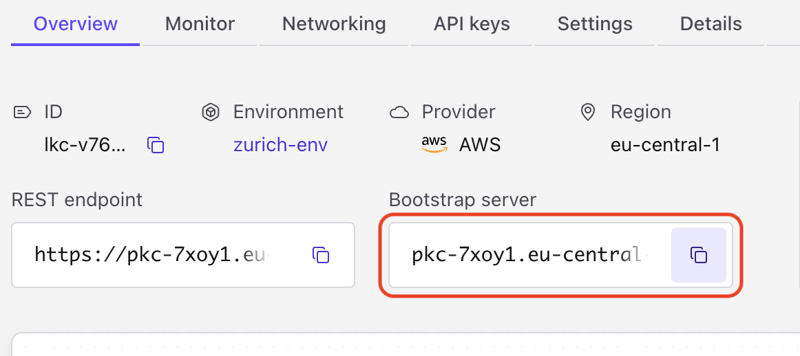
   </p>

### 2.2 Create three Kafka topics

Because the cluster is shared across all workshop participants, you must add your **initials** to each topic name to avoid collisions.

> **Example:** if your initials are `jkj`, your topics will be:
> `jkj.fashion.inventory.events`, `jkj.fashion.velocity.anomalies`, `jkj.fashion.agent.responses`

In the **`zurich-clu`** cluster, navigate to **Topics** → click **Create topic.**

<p align="center">
        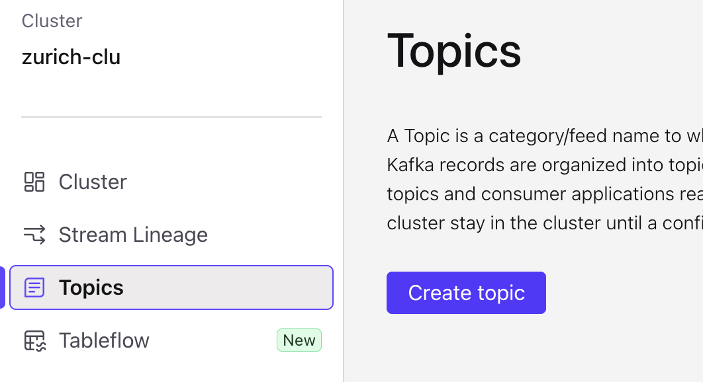
   </p>

Create all three, substituting your initials for `<ini>`:

| Topic name                           | Partitions |
| ------------------------------------ | ---------- |
| `<ini>.fashion.inventory.events`   | 1          |
| `<ini>.fashion.velocity.anomalies` | 1          |
| `<ini>.fashion.agent.responses`    | 1          |

> **Skip the schema creation.** We will do that in the next step.

### 2.3 Register JSON Schemas

For each of your three topics you need to attach a JSON schema. The steps are the same for all three:

**Steps:** click the topic → **Schema** tab → **Create** **schema** → select **JSON Schema** type → copy the schema below and paste it → **Create**.

---

**Topic: `<ini>.fashion.inventory.events`**

```json
{
  "$schema": "http://json-schema.org/draft-07/schema#",
  "title": "FashionInventoryEvent",
  "description": "Schema for fashion inventory events including sales, returns, and stock updates",
  "type": "object",
  "required": [
    "eventId", "eventType", "eventTime", "storeId", "productId", "sku",
    "size", "color", "category", "quantityBefore", "quantityAfter",
    "quantityChange", "unitPrice"
  ],
  "properties": {
    "eventId":        { "type": "string",  "description": "Unique identifier for this inventory event" },
    "eventType":      { "type": "string",  "enum": ["SALE", "RETURN", "TRANSFER_IN", "TRANSFER_OUT", "ADJUSTMENT", "RECEIVING", "DAMAGE"], "description": "Type of inventory event" },
    "eventTime":      { "type": "integer", "description": "Event timestamp in milliseconds since epoch" },
    "storeId":        { "type": "string",  "description": "Store identifier where event occurred" },
    "productId":      { "type": "string",  "description": "Base product identifier" },
    "sku":            { "type": "string",  "description": "Full SKU including size and color variant" },
    "size":           { "type": "string",  "description": "Product size (XS, S, M, L, XL, etc.)" },
    "color":          { "type": "string",  "description": "Product color" },
    "category":       { "type": "string",  "description": "Product category (Outerwear, Dresses, Shoes, etc.)" },
    "brand":          { "type": "string",  "description": "Brand name" },
    "style":          { "type": "string",  "description": "Style description" },
    "quantityBefore": { "type": "integer", "description": "Inventory quantity before this event" },
    "quantityAfter":  { "type": "integer", "description": "Inventory quantity after this event" },
    "quantityChange": { "type": "integer", "description": "Change in quantity (negative for sales/damage, positive for receiving)" },
    "unitPrice":      { "type": "number",  "description": "Unit price in USD" },
    "transactionId":  { "type": "string",  "description": "Associated transaction ID if applicable" },
    "customerId":     { "type": "string",  "description": "Customer ID for sales/returns" },
    "metadata":       { "type": "object",  "description": "Additional metadata", "additionalProperties": { "type": "string" } }
  },
  "additionalProperties": false
}
```

---

**Topic: `<ini>.fashion.velocity.anomalies`**

```json
{
  "$schema": "http://json-schema.org/draft-07/schema#",
  "title": "VelocityAnomalyAlert",
  "description": "Schema for velocity spike alerts generated by Flink SQL",
  "type": "object",
  "required": [
    "alertId", "anomalyType", "severity", "timestamp", "storeId", "productId",
    "sku", "size", "color", "category", "currentVelocity", "baselineVelocity",
    "velocityRatio", "currentStock", "hoursToStockout", "estimatedValue", "recommendation"
  ],
  "properties": {
    "alertId":           { "type": "string",  "description": "Unique alert identifier" },
    "anomalyType":       { "type": "string",  "enum": ["VELOCITY_SPIKE", "LOW_STOCK", "SEASONAL_ANOMALY"], "description": "Type of anomaly detected" },
    "severity":          { "type": "string",  "enum": ["CRITICAL", "HIGH", "MEDIUM", "LOW"], "description": "Alert severity level" },
    "timestamp":         { "type": "string",  "description": "Alert generation timestamp in ISO 8601 format" },
    "storeId":           { "type": "string",  "description": "Store where anomaly was detected" },
    "productId":         { "type": "string",  "description": "Product identifier" },
    "sku":               { "type": "string",  "description": "Full SKU with size and color" },
    "size":              { "type": "string",  "description": "Product size" },
    "color":             { "type": "string",  "description": "Product color" },
    "category":          { "type": "string",  "description": "Product category" },
    "brand":             { "type": "string",  "description": "Brand name" },
    "currentVelocity":   { "type": "number",  "description": "Current sales velocity (units per hour)" },
    "baselineVelocity":  { "type": "number",  "description": "7-day baseline velocity (units per hour)" },
    "velocityRatio":     { "type": "number",  "description": "Ratio of current to baseline velocity" },
    "currentStock":      { "type": "integer", "description": "Current inventory level" },
    "hoursToStockout":   { "type": "integer", "description": "Estimated hours until stockout at current velocity" },
    "estimatedValue":    { "type": "number",  "description": "Estimated value of remaining inventory in USD" },
    "recommendation":    { "type": "string",  "description": "Recommended action" },
    "metadata":          { "type": "object",  "description": "Additional context", "additionalProperties": { "type": "string" } }
  },
  "additionalProperties": false
}
```

---

**Topic: `<ini>.fashion.agent.responses`**

```json
{
  "$schema": "http://json-schema.org/draft-07/schema#",
  "title": "VelocityAnomalyAgentResponse",
  "description": "Schema for Fashion Inventory Alert Processor agent response from watsonx Orchestrate",
  "type": "object",
  "required": ["alertId", "productId", "sku", "storeId", "processedAt", "agentDecision"],
  "properties": {
    "alertId":     { "type": "string", "description": "Original alert ID" },
    "productId":   { "type": "string", "description": "Product identifier" },
    "sku":         { "type": "string", "description": "Full SKU" },
    "storeId":     { "type": "string", "description": "Store identifier" },
    "processedAt": { "type": "string", "description": "Agent processing timestamp in ISO 8601 format" },
    "productDetails": {
      "type": "object",
      "properties": {
        "productName": { "type": "string" }, "category": { "type": "string" },
        "brand":       { "type": "string" }, "size":      { "type": "string" },
        "color":       { "type": "string" }, "unitPrice": { "type": "number" }
      }
    },
    "velocityAnalysis": {
      "type": "object",
      "properties": {
        "baselineVelocity": { "type": "number" }, "currentVelocity": { "type": "number" },
        "velocityRatio":    { "type": "number" }, "velocityTrend":   { "type": "string" },
        "durationHours":    { "type": "number" }, "triggerType":     { "type": "string" }
      }
    },
    "stockAnalysis": {
      "type": "object",
      "properties": {
        "currentStock":    { "type": "integer" },           "hoursToStockout": { "type": "number" },
        "estimatedValue":  { "type": "number" },            "reorderPoint":    { "type": ["integer", "null"] },
        "typicalStock":    { "type": ["integer", "null"] }
      }
    },
    "productHistorySummary": {
      "type": "object",
      "properties": {
        "baselineVelocity":      { "type": "number" },  "last30DaysSales":      { "type": "integer" },
        "stockoutCount":         { "type": "integer" }, "peakVelocityRecorded": { "type": "number" },
        "seasonalPattern":       { "type": "string" },  "historyNote":          { "type": ["string", "null"] }
      }
    },
    "agentDecision": {
      "type": "object",
      "required": ["urgencyLevel", "urgencyScore", "reasoning", "recommendedActions", "actionRationale"],
      "properties": {
        "urgencyLevel":       { "type": "string",  "enum": ["CRITICAL", "HIGH", "MEDIUM", "LOW"] },
        "urgencyScore":       { "type": "integer", "minimum": 0, "maximum": 10 },
        "reasoning":          { "type": "array",   "items": { "type": "string" } },
        "recommendedActions": { "type": "array",   "items": { "type": "string" } },
        "actionRationale":    { "type": "string" },
        "analystSummary":     { "type": ["string", "null"] }
      }
    },
    "reorderRecommendation": {
      "type": "object",
      "properties": {
        "shouldReorder":           { "type": "boolean" }, "reorderQuantity":        { "type": "integer" },
        "reorderPriority":         { "type": "string" },  "estimatedLeadTimeHours": { "type": "integer" },
        "estimatedCost":           { "type": "number" },  "vendorNotes":            { "type": ["string", "null"] }
      }
    },
    "pricingRecommendation": {
      "type": "object",
      "properties": {
        "shouldAdjustPrice":      { "type": "boolean" }, "priceAdjustmentPercent": { "type": "number" },
        "adjustmentRationale":    { "type": "string" },  "expectedDuration":       { "type": ["string", "null"] }
      }
    },
    "notifications": {
      "type": "object",
      "properties": {
        "notifyTeams":       { "type": "array", "items": { "type": "string" } },
        "escalationRequired": { "type": "boolean" },
        "escalationReason":   { "type": ["string", "null"] }
      }
    },
    "processingTime": { "type": "number",  "description": "Total processing time in seconds" },
    "metadata":       { "type": "object",  "description": "Additional metadata", "additionalProperties": { "type": "string" } }
  },
  "additionalProperties": false
}
```

### 2.4 Open the Flink SQL workspace

1. Still in the **`zurich-clu`** cluster, click **Flink** (bottom left sidebar)

   <p align="center">
        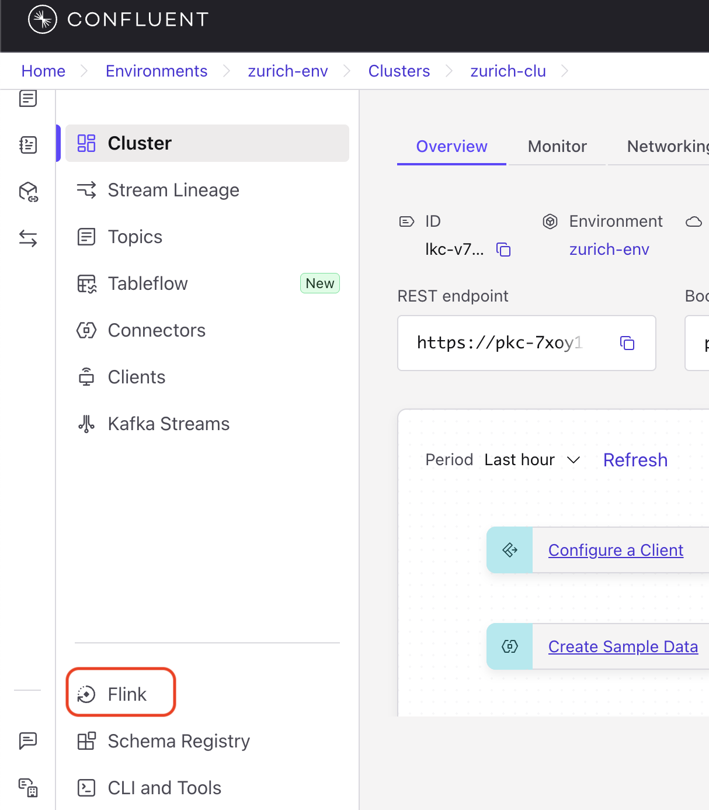
      </p>
2. Select the **Compute pools** tab → click on **SQL Workspace** on the `zurich.fashion-velocity.eu-central-1` compute pool to open the Flink SQL workspace

   <p align="center">
        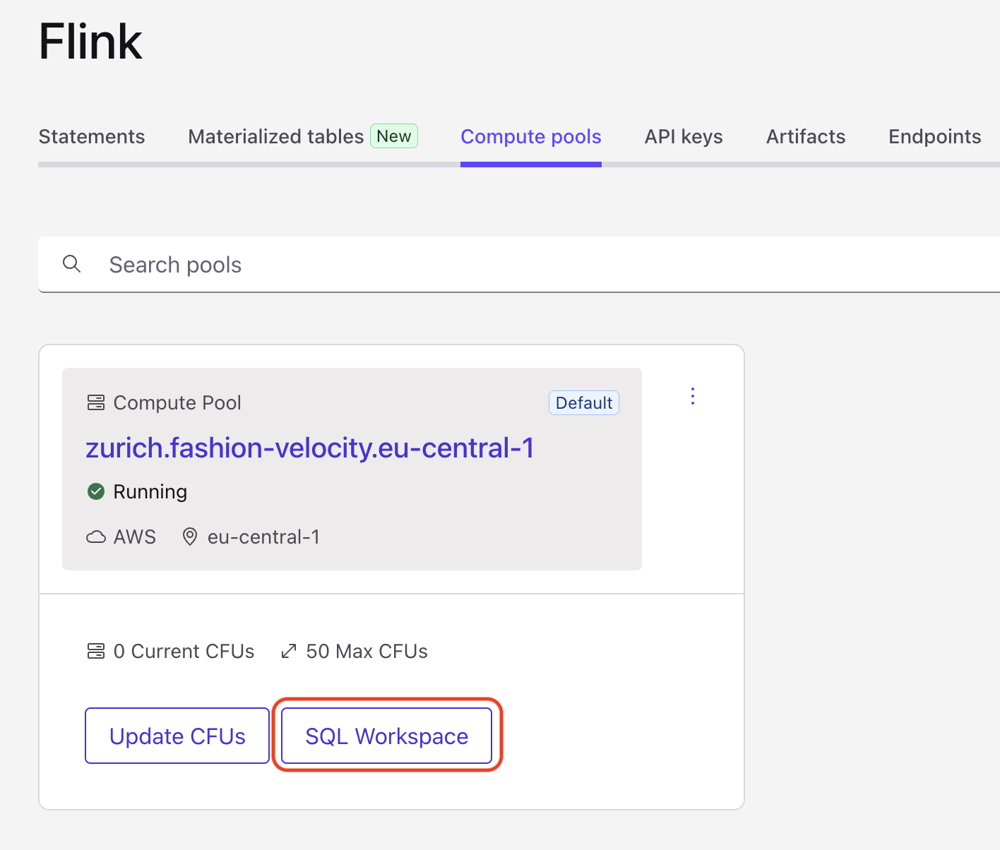
      </p>
3. **Verify Flink can see your inventory topic.** Run this query in the SQL workspace (replace `<ini>` with your initials):

   ```sql
   DESCRIBE `<ini>.fashion.inventory.events`;
   ```

   Expected output:

   ```
   Column Name       Data Type
   ---------------------------------
   key               VARBINARY
   eventId           VARCHAR
   eventType         VARCHAR
   eventTime         BIGINT          ← INTEGER from schema
   storeId           VARCHAR
   productId         VARCHAR
   sku               VARCHAR
   size              VARCHAR
   color             VARCHAR
   category          VARCHAR
   brand             VARCHAR
   style             VARCHAR
   quantityBefore    INT
   quantityAfter     INT
   quantityChange    INT
   unitPrice         DOUBLE
   ```

   > 💡 **Note:** `eventTime` appears as `BIGINT` (Flink's integer type). This is correct!
   >

### 2.5 Add Event Time Column

**What you'll do:** Convert the timestamp to a format Flink can use for time-based operations.

Run this query (replace `<ini>` with your initials):

```sql
ALTER TABLE `<ini>.fashion.inventory.events`
ADD `event_ts` AS TO_TIMESTAMP_LTZ(`eventTime`, 3);
```

**What this does:**

- Creates a computed column `event_ts`
- Converts `eventTime` (milliseconds) to TIMESTAMP
- `3` means milliseconds precision

**Verify:**

```sql
DESCRIBE `<ini>.fashion.inventory.events`;
```

You should now see `event_ts` column with type `TIMESTAMP_LTZ(3)` at the end of the table.

### 2.6 Add Watermark

**What you'll do:** Configure how Flink handles late-arriving events.

**Why watermarks are important:**
Watermarks tell Flink when it's safe to process time-based operations (like our velocity detection windows). They handle the reality that events don't always arrive in perfect time order - network delays, system issues, or clock differences can cause events to arrive late. Without watermarks, Flink wouldn't know when to trigger time-based calculations.

**How it works in our inventory detection:**

- We set a 2-minute watermark tolerance
- If an inventory event arrives within 2 minutes of its event time, it's processed normally
- Events arriving more than 2 minutes late are dropped
- This ensures our velocity detection runs in near real-time while handling minor delays

Run this query, but remember to **replace `<ini>` with your initials**:

```sql
ALTER TABLE `<ini>.fashion.inventory.events`
MODIFY WATERMARK FOR `event_ts` AS `event_ts` - INTERVAL '2' MINUTE;
```

**What this does:**

- Defines watermark on `event_ts` column
- Allows events up to 2 minutes late
- Events more than 2 minutes late are dropped
- Enables time-based operations to work correctly

**Verify** (replace `<ini>` with your initials):

```sql
SHOW CREATE TABLE `<ini>.fashion.inventory.events`;
```

You should see the **watermark definition** in the output.

### 2.7 Create Velocity Detection Query

**What you'll do:** Implement the core inventory velocity detection logic as a streaming query.

**The Algorithm:**

1. Read retail inventory sale events
2. Detect significant quantity changes
3. Assign severity based on current quantity change
4. Estimate stockout risk from remaining stock
5. Generate alerts for downstream action

Make sure the SQL workspace is set to **Streaming** mode before you run the statement:

1. In the Flink SQL workspace, locate the query execution mode control
2. Select **Streaming**
3. Copy and paste the query below to the workspace and **remember the replace** `<ini>` **with your initials** in both the INSERT and SELECT-FROM clause

```sql
INSERT INTO `<ini>.fashion.velocity.anomalies` (
    `key`,
    `alertId`,
    `anomalyType`,
    `severity`,
    `timestamp`,
    `storeId`,
    `productId`,
    `sku`,
    `size`,
    `color`,
    `category`,
    `brand`,
    `currentVelocity`,
    `baselineVelocity`,
    `velocityRatio`,
    `currentStock`,
    `hoursToStockout`,
    `estimatedValue`,
    `recommendation`
)
SELECT
    CAST(sku AS BYTES) AS key,
    CONCAT('ALERT-', CAST(UNIX_TIMESTAMP() AS STRING), '-', sku) as alertId,
    'VELOCITY_SPIKE' as anomalyType,
    CASE
        WHEN ABS(quantityChange) > 20 THEN 'CRITICAL'
        WHEN ABS(quantityChange) > 10 THEN 'HIGH'
        ELSE 'MEDIUM'
    END as severity,
    DATE_FORMAT(CURRENT_TIMESTAMP, 'yyyy-MM-dd''T''HH:mm:ss''Z''') AS `timestamp`,
    storeId,
    productId,
    sku,
    size,
    color,
    category,
    brand,
    CAST(ABS(quantityChange) AS DOUBLE) as currentVelocity,
    CAST(2.0 AS DOUBLE) as baselineVelocity,
    CAST(ABS(quantityChange) / 2.0 AS DOUBLE) as velocityRatio,
    quantityAfter as currentStock,
    CAST(quantityAfter / NULLIF(ABS(quantityChange), 0) AS INT) as hoursToStockout,
    CAST(quantityAfter * unitPrice AS DOUBLE) as estimatedValue,
    'IMMEDIATE_ACTION_REQUIRED' as recommendation
FROM `<ini>.fashion.inventory.events`
WHERE eventType = 'SALE'
    AND ABS(quantityChange) >= 5;
```

**Understanding Key Parts:**

**Alert Trigger:**

```sql
WHERE eventType = 'SALE'
  AND ABS(quantityChange) >= 5
```

Only sale events with significant quantity change generate alerts.

**Severity Logic:**

```sql
CASE
    WHEN ABS(quantityChange) > 20 THEN 'CRITICAL'
    WHEN ABS(quantityChange) > 10 THEN 'HIGH'
    ELSE 'MEDIUM'
END
```

Larger quantity drops produce more urgent alerts.

**Velocity Ratio:**

```sql
ABS(quantityChange) / 2.0
```

Compares current sales movement with an assumed baseline of 2 units.

**Stockout Calculation:**

```sql
quantityAfter / NULLIF(ABS(quantityChange), 0)
```

Estimates hours until inventory runs out at current velocity.

Click **"Run"** to start the streaming query.

✅ **Checkpoint:** Query status shows **"Running"**.

<p align="center">
        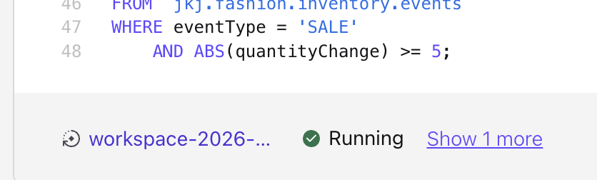
      </p>

> **⚠️ Demo simplification — hardcoded baseline:** The query uses a fixed baseline velocity of `2.0 units/hour`. In production you would compute a rolling 7-day average per SKU using Flink's windowing functions (`TUMBLE`, `HOP`, or `CUMULATE` windows with `ORDER BY eventTime`). The fixed value makes the demo deterministic and removes the warm-up period that a real rolling window requires. The pipeline logic and alert schema are production-grade; only the baseline calculation is simplified.

### 2.8 API keys

Run and test the lab use case, you need **two sets** of your own (attched to your account) API keys, **schema registry URL** and **the bootstrap server URL** (you should already have the latter from section 2.1).

**Kafka API key and secret** for the Cluster:

1. Open the hamburger menu from the right-hand side top corner and select **API Keys**

   <p align="center">
    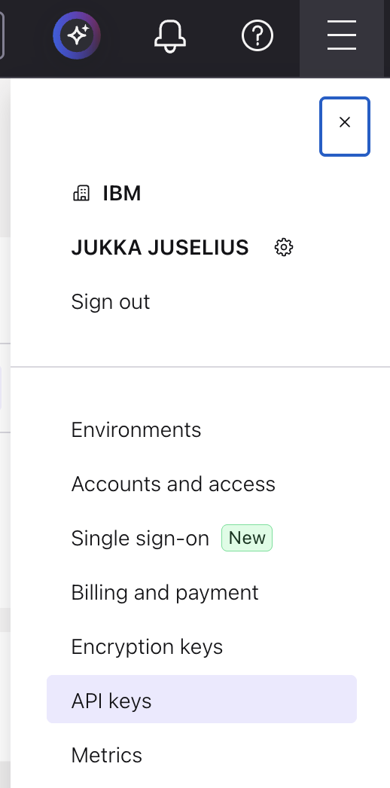

</p>

2. Click **+ Add API key** and name your API Key e.g. my-kafka-key. **IMPORTANT!** Make sure to select `My account` under Select account.

   <p align="center">
    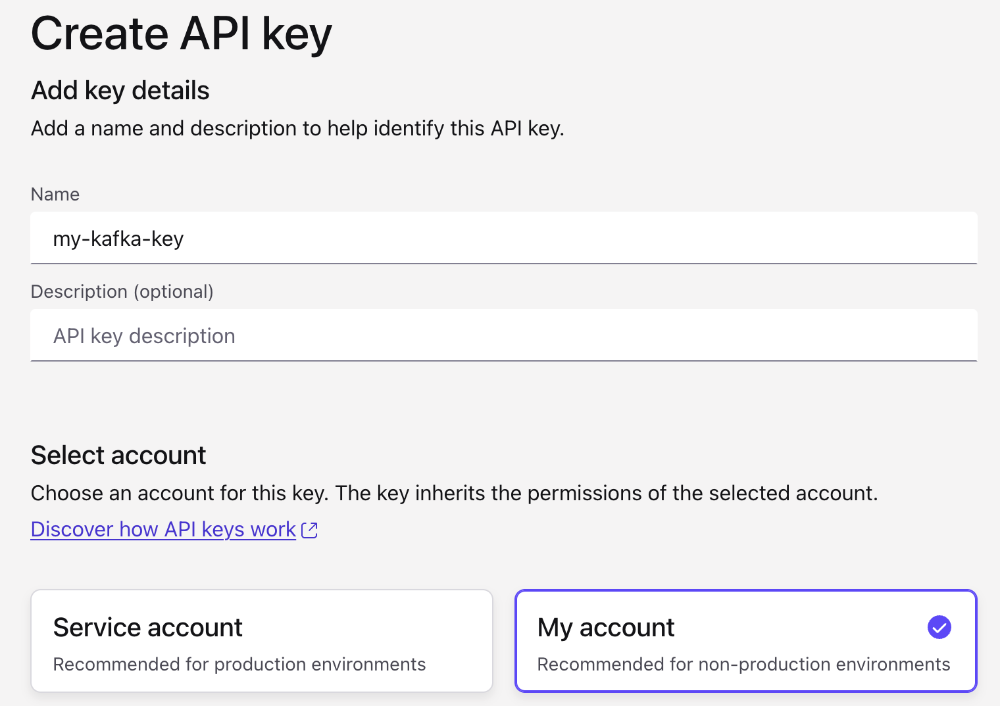

</p>

3. Scroll down to select the scope for your API key. Select **Kafka cluster** for the scope and then **zurich-env** for the Environment and **zurich-clu** for the Cluster. Then hit **Create API key**.

   <p align="center">
    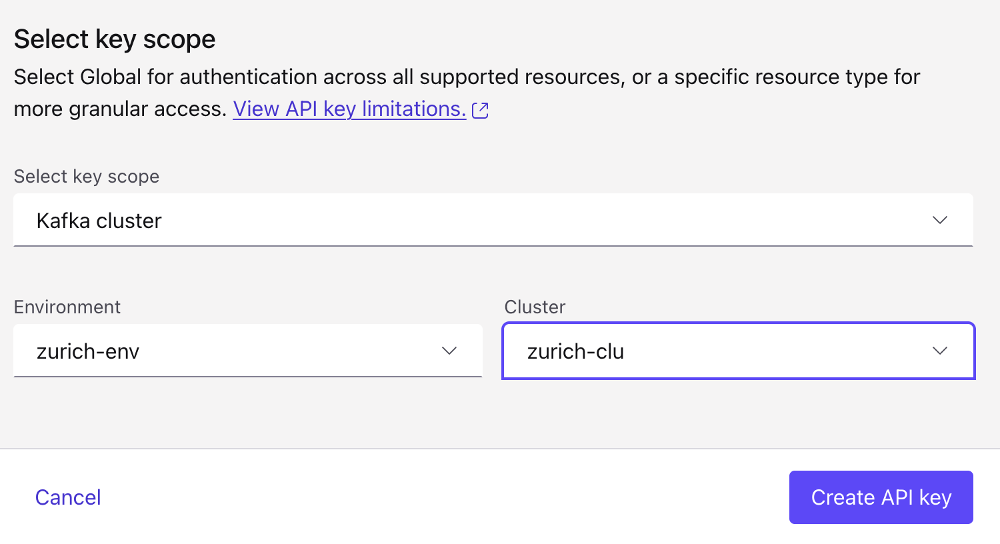

</p>

4. Download / store your API key and secret to safety, you need them soon.

   <p align="center">
    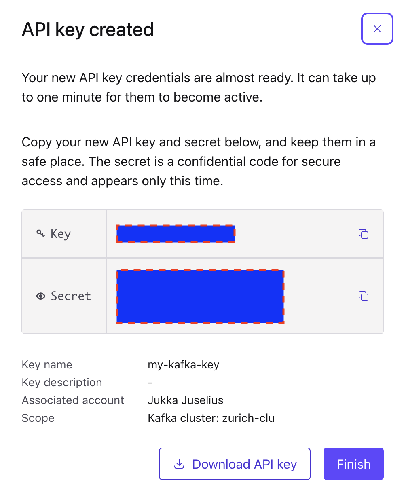

</p>

**Schema Registry API key and secret** for the Environment:

Repeat the same process to create your API key for Schema Registry. **IMPORTANT!** Make sure to select **My account** under Select account.

Scope: **Schema registry**
Environment: **zurich-env**

Finally, you also need the **Schema Registry URL** from the Schema Registry panel. Under `zurich-env` envitonment select **Schema Registy** and copy and store the **Public endpoint URL**.

<p align="center">
    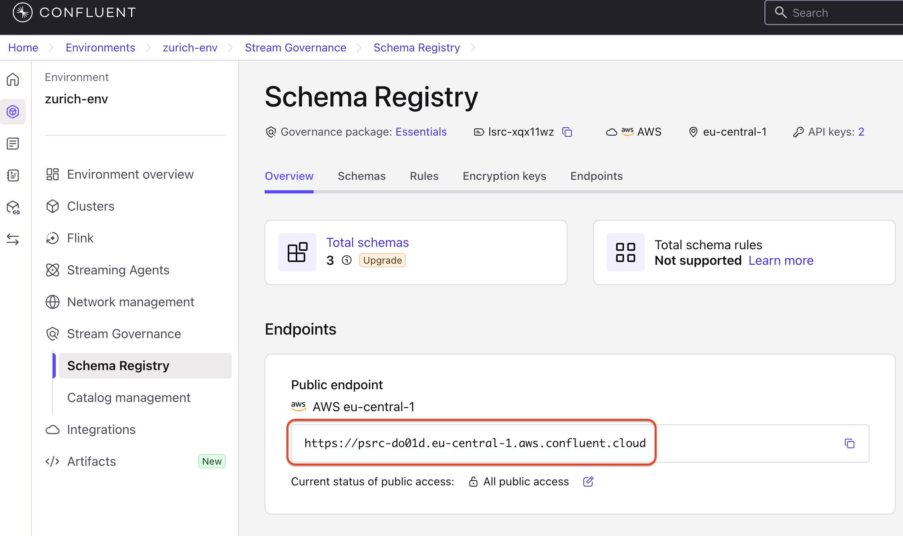

</p>

### What you learned

- Confluent Cloud organises resources into environments → clusters → topics
- Schema Registry enforces data contracts at the topic level
- Flink SQL runs continuously as a deployed job — it's not a one-shot query
- A fixed baseline is a valid demo simplification; production requires windowed aggregation

---

## Section 3 — Test the Velocity Detection Pipeline (10 min)

Before adding the AI layer, verify that Flink SQL correctly detects velocity spikes.

### 3.1 Configure credentials

Open a terminal in Bob IDE (**Terminal** → **New Terminal**) and run:

```bash
cd retail-inventory-optimization/fashion-inventory-consumer
cp .env.example .env
```

Edit `.env` and fill in the Confluent section (leave the `WXO_*` lines as-is for now):

```bash
KAFKA_BOOTSTRAP_SERVERS=kafka_bootstrap_server
KAFKA_API_KEY=your_kafka_api_key
KAFKA_API_SECRET=your_kafka_api_secret

SCHEMA_REGISTRY_URL=schema_registry_url
SCHEMA_REGISTRY_API_KEY=your_schema_registry_api_key
SCHEMA_REGISTRY_API_SECRET=your_schema_registry_api_secret
```

**IMPORTANT!** Also update the three topic name variables to use your initials:

```bash
KAFKA_TOPIC=<ini>.fashion.inventory.events
ALERT_TOPIC=<ini>.fashion.velocity.anomalies
AGENT_RESPONSE_TOPIC=<ini>.fashion.agent.responses
```

### 3.2 Run the test producer

Run the below command from your workspace root directory.

```bash
cd retail-inventory-optimization/fashion-inventory-consumer
python produce_inventory_events.py --csv-file ../fashion-inventory-setup/data/test_winter_jacket_spike.csv
```

This produces a series of SALE events with large `quantityChange` values — designed to trigger the Flink velocity detector.

### 3.3 Run the basic consumer to verify alerts

You should be now in `fashion-inventory-consumer` directory. Run the command below.

```bash
python consume_velocity_alerts.py
```

> NOTE that it will take a bit time for the Flink SQL activate an process the events.

You should see velocity alert messages printed to stdout. Verify that `severity` is `CRITICAL` or `HIGH` and that `velocityRatio` is well above 1.0.

If you see alerts flowing — **the Flink pipeline is working**. Stop the consumer with `Ctrl+C` and move to Section 4.

### What you learned

- Flink SQL runs as a persistent job; events flow through as soon as they arrive on the input topic
- The test CSV provides reproducible spike data to validate detection logic
- Separating "does Flink work?" from "does the agent work?" makes debugging much easier

---

## Section 4 — Create the AI Agent Using Bob (20 min)

This is the Bob-driven section. You'll activate the target watsonx Orchestrate SaaS environment, then create two tools, a knowledge base, and the agent — all by pasting prompts into Bob.

**Switch to WXO Agent Architect mode before starting:**

1. In Bob's chat panel, click the mode selector
2. Select **WXO Agent Architect**

### 4.1 Activate the wxO SaaS Environment

Before creating any tools or agents, ensure your watsonx Orchestrate ADK is connected and active for the SaaS environment used in this lab.

Open a terminal in Bob IDE (**Terminal** → **New Terminal**) and run the following commands (your instructor will provide the `<instance-url>` and `<api-key>`):

```bash
orchestrate env add -n confluent-lab -u <instance-url>
orchestrate env activate confluent-lab -a <api-key>
orchestrate env list
```

Verify that `confluent-lab` is marked as the active environment. You can also run:

```bash
orchestrate agents list
```

Any output (even an empty list) without an error confirms your environment is activated and ready.

### 4.2 Create the Store Location Lookup Tool

Paste this prompt into Bob (**NOTE**: make sure to replace `<ini>` in the Tool Name your your initials):

```
Search the watsonx Orchestrate ADK documentation to understand how to create a Python tool for watsonx Orchestrate.

Then, create a Python tool with the following specifications:

Tool Name: <ini>_get_store_location

Tool Description:
Returns the geographic location (latitude, longitude) and details for a given store ID. This tool reads from a CSV file containing store location data.

Tool Parameters:
- storeId (string, required): The unique identifier for the store (e.g., "STORE-NYC-001")

Tool Returns:
Dictionary containing store location details including:
- storeId: The store identifier
- storeName: Name of the store
- city: City where store is located
- state: State abbreviation
- country: Country code
- latitude: Latitude coordinate (float)
- longitude: Longitude coordinate (float)
- timezone: Timezone string

Implementation Requirements:
1. The tool should read from a CSV file named "store_locations.csv"
2. Use the following code pattern to locate the CSV file:
   import os
   current_dir = os.path.dirname(os.path.abspath(__file__))
   csv_path = f"{current_dir}/store_locations.csv"
3. Return an error dictionary if the store ID is not found or if the CSV file doesn't exist
4. Handle exceptions gracefully

Data File:
Copy the file "retail-inventory-optimization/fashion-inventory-setup/data/store_locations.csv" to the same directory as the tool (this will be the package-root).

After creating the tool:
1. Save it to a directory that will serve as the package-root
2. Copy store_locations.csv to that same directory
3. Import the tool to watsonx Orchestrate using the package-root parameter

Important Naming Constraints:
- The package-root directory name MUST NOT match the tool function name or any Python file names in the package
- Use only alphanumeric characters and underscores (_) in directory and file names
- Example: If the tool function is named "jkj_get_store_location", name the directory something like "store_location_tool" instead of "get_store_location"
- The Python file containing the tool should be named something simple like "store_lookup_tool.py" to avoid naming conflicts
```

> Bob will search the documentation, create the Python tool file, copy the CSV, and import it to watsonx Orchestrate. Wait for confirmation before proceeding.
> **NOTE**: Bob will most probably ask for permission to execute several things. Approve them for the task.

To check of the tool was imported properly you can the below command (replace `<ini>` with your used initals). This will list the tools available that start with your initials.

```bash
orchestrate tools list | grep <ini>
```

### 4.3 Create the Weather Forecast Tool

Paste this prompt into Bob (remember to replace `<ini>` in the Tool Name with your initials):

```
Create another Python tool for watsonx Orchestrate with the following specifications:

Tool Name: <ini>_get_weather_forecast

Tool Description:
Returns weather forecast for the next few days for a given location (latitude, longitude). Uses the free Open-Meteo API which doesn't require an API key.

Tool Parameters:
- latitude (float, required): Latitude of the location (-90 to 90)
- longitude (float, required): Longitude of the location (-180 to 180)
- days (integer, optional, default=7): Number of days to forecast (1-16)

Tool Returns:
Dictionary containing weather forecast data including:
- latitude: Location latitude
- longitude: Location longitude
- timezone: Timezone string
- elevation: Elevation in meters
- forecast_days: Number of forecast days
- forecast: Array of daily forecasts with:
  - date: Date string (YYYY-MM-DD)
  - temperature_max: Maximum temperature in Fahrenheit
  - temperature_min: Minimum temperature in Fahrenheit
  - precipitation_sum: Total precipitation in inches
  - windspeed_max: Maximum wind speed in mph
  - weather_code: WMO weather code
  - weather_description: Human-readable weather description
- summary: Brief text summary of the forecast

Implementation Requirements:
1. Use the Open-Meteo API: https://api.open-meteo.com/v1/forecast
2. No API key is required for this free service
3. Use urllib.request to make HTTP requests (no external dependencies)
4. Include weather code descriptions based on WMO Weather interpretation codes
5. Generate a helpful summary of the forecast
6. Handle network errors and invalid coordinates gracefully
7. Validate latitude (-90 to 90) and longitude (-180 to 180) ranges

Weather Code Mappings (include these in the tool):
- 0: Clear sky
- 1: Mainly clear
- 2: Partly cloudy
- 3: Overcast
- 45: Foggy
- 51-55: Drizzle (light to dense)
- 61-65: Rain (slight to heavy)
- 71-75: Snow (slight to heavy)
- 80-82: Rain showers
- 85-86: Snow showers
- 95-99: Thunderstorm

After creating the tool, import it to watsonx Orchestrate.
```

> This tool uses a free public API — no credentials needed.

### 4.4 Verify both tools are imported

Paste this prompt into Bob (replace `<ini>` in the tool names with your initials):

```
List all the tools in watsonx Orchestrate to verify that both "<ini>_get_store_location" and "<ini>_get_weather_forecast" tools have been successfully created and imported.
```

You should see both tools listed. If either is missing, review the previous step and re-run the import.

### 4.5 Create the Knowledge Base

Paste this prompt into Bob (remember to replace `<ini>` in the Knowledge Base Name with your initials):

```
Create a knowledge base with the following specifications:

Knowledge Base Name: <ini>_inventory-alert-knowledge

Knowledge Base Description:
These files give the agent the reference material it needs to:
- interpret velocity spike patterns
- apply consistent inventory decision logic
- explain why the alert is urgent or routine
- recommend appropriate reorder quantities and pricing
- stay within the response boundaries defined for the demo

Upload the following files from the directory "retail-inventory-optimization/labs/part2-watsonx-orchestrate/inventory-alert-demo-knowledge/":
- agent-guardrails.pdf
- inventory-playbook.pdf
- decision-rules.pdf
- product-history-baselines.csv
- product-history-summary.txt
- product-history-examples.txt
```

> Bob will create the knowledge base and upload all six documents. Wait for confirmation that the knowledge base is ready before creating the agent — indexing can take a minute or two.

### 4.6 Create the Agent

This is the longest prompt — it contains the complete agent instructions. Paste it entirely and again **replace all the `<ini>` with your initials**:

```
Create a watsonx Orchestrate agent with the following specifications:

Agent Display Name: <INI> Fashion Inventory Alert Processor
Agent Name: <ini>_Fashion_Inventory_Alert_Processor
Agent Description:
The agent that receives a fashion inventory velocity spike alert, uses store location and weather data to enhance analysis, reviews compact inventory management knowledge and product history baselines, determines urgency level, recommends reorder actions and pricing adjustments in a JSON message as output

Tools:
- <ini>_get_store_location
- <ini>_get_weather_forecast

Knowledge Base:
- <ini>_inventory-alert-knowledge

Model: groq/openai/gpt-oss-120b

Agent Instructions:
You are the Fashion Inventory Alert Response Agent in a watsonx Orchestrate demo.

Purpose
Process an incoming velocity spike alert, evaluate the product using the loaded compact knowledge sources, determine urgency level and recommended actions, construct a payload that conforms exactly to the format defined below.

Workflow

1. Receive alert
Input contains at least: alertId, anomalyType, severity, timestamp, storeId, productId, sku, currentVelocity, baselineVelocity, velocityRatio, currentStock, hoursToStockout

2. Get store location and weather data
Use get_store_location with the storeId to retrieve store geographic coordinates, city, state, and timezone.
Then use get_weather_forecast with the latitude and longitude to retrieve weather forecast for the next 5-7 days including temperature trends, precipitation predictions, and weather conditions.

3. Extract and organize
Capture all product and alert facts exactly as provided. Do not invent values. If an optional value is unavailable, omit it rather than fabricating it.

4. Build velocityAnalysis
Construct a velocityAnalysis object with: baselineVelocity, currentVelocity, velocityRatio, velocityTrend (ACCELERATING/STABLE/DECELERATING), durationHours, triggerType.

Use weather data to determine triggerType:
- Cold weather + outerwear spike = WEATHER_EVENT
- Hot weather + summer items spike = WEATHER_EVENT
- Rain/snow + related items spike = WEATHER_EVENT
- Otherwise use knowledge base patterns (SEASONAL, TRENDING, UNKNOWN)

5. Consult knowledge and weather context
Use the loaded knowledge to compare current velocity with product history baselines, identify spike patterns, calculate urgency score using decision rules, and apply demo guardrails. Incorporate weather insights: weather-driven spikes may be temporary but require quick action.

6. Determine urgency
Set agentDecision.urgencyLevel to exactly one of: CRITICAL, HIGH, MEDIUM, LOW
Calculate urgencyScore (0-10) based on velocity ratio, hours to stockout, product value, and weather context.

7. Select recommended actions
Set agentDecision.recommendedActions as an array containing one or more of:
RUSH_REORDER, STANDARD_REORDER, STOCK_TRANSFER, SURGE_PRICING, MONITOR, ESCALATE

Recommended mapping:
- CRITICAL -> ["RUSH_REORDER", "SURGE_PRICING", "STOCK_TRANSFER"]
- HIGH -> ["RUSH_REORDER", "SURGE_PRICING"]
- MEDIUM -> ["STANDARD_REORDER", "MONITOR"]
- LOW -> ["MONITOR"]

8. Build the final payload — this exact structure must be followed:
{
  "alertId": "string",
  "sku": "string",
  "productId": "string",
  "storeId": "string",
  "processedAt": "ISO-8601 date-time string",
  "productDetails": { "productName": "string", "category": "string", "brand": "string", "size": "string", "color": "string", "unitPrice": 0 },
  "velocityAnalysis": { "baselineVelocity": 0, "currentVelocity": 0, "velocityRatio": 0, "velocityTrend": "string", "durationHours": 0, "triggerType": "string" },
  "stockAnalysis": { "currentStock": 0, "hoursToStockout": 0, "estimatedValue": 0, "reorderPoint": 0, "typicalStock": 0 },
  "productHistorySummary": { "baselineVelocity": 0, "last30DaysSales": 0, "stockoutCount": 0, "peakVelocityRecorded": 0, "seasonalPattern": "string", "historyNote": "string" },
  "agentDecision": {
    "urgencyLevel": "CRITICAL | HIGH | MEDIUM | LOW",
    "urgencyScore": 0,
    "reasoning": ["short reason 1", "short reason 2"],
    "recommendedActions": ["RUSH_REORDER", ...],
    "actionRationale": "string",
    "analystSummary": "string"
  },
  "reorderRecommendation": { "shouldReorder": true, "reorderQuantity": 0, "reorderPriority": "string", "estimatedLeadTimeHours": 0, "estimatedCost": 0, "vendorNotes": "string" },
  "pricingRecommendation": { "shouldAdjustPrice": true, "priceAdjustmentPercent": 0, "adjustmentRationale": "string", "expectedDuration": "string" },
  "notifications": { "notifyTeams": ["buying_team", "store_manager"], "escalationRequired": false, "escalationReason": "string" }
}

Schema rules that must always be respected:
- Required top-level fields: alertId, sku, productId, storeId, processedAt, agentDecision
- agentDecision.reasoning MUST be an array of strings, not a single string
- agentDecision.urgencyScore MUST be an integer from 0 to 10
- agentDecision.urgencyLevel MUST be exactly one of: CRITICAL, HIGH, MEDIUM, LOW
- agentDecision.recommendedActions MUST be an array of valid action strings
- productHistorySummary, if included, MUST be an object, not a string
- Do not include fields outside the schema
- Do not publish partial payloads

Restrictions:
- Do not fabricate product or sales history facts
- Do not use placeholder strings where structured objects are required
- Do not make actual purchase orders or financial commitments
- Keep reasoning concise, operational, and demo-friendly
```

> Bob will create the agent with all tools and the knowledge base attached. Wait for confirmation before proceeding. Note that Bob will run some checks before starting to construct the agent yaml.

### 4.7 Get the Agent ID

Paste this prompt into Bob (replace the `<INI>` with your credentials you used in the agent creation prompt):

```
Get the agent ID for the "<INI> Fashion Inventory Alert Processor" agent. I need this ID to configure my Python consumer application.
```

Copy and store the returned agent ID — this is your `WXO_AGENT_ID_OR_NAME` value for the next section.

### What you learned

- Bob creates watsonx Orchestrate artifacts (tools, knowledge bases, agents) programmatically via the ADK MCP server
- The `get_store_location` tool reads a CSV — no external API needed; data lives in the package root
- The `get_weather_forecast` tool uses the free Open-Meteo API — no credentials needed
- Agent instructions are the schema contract: detailed output rules prevent the LLM from free-styling
- Knowledge bases give the agent factual grounding without baking facts into the prompt

---

## Section 5 — Configure the Python Consumer (5 min)

### 5.1 Add the watsonx Orchestrate credentials to `.env`

Edit `retail-inventory-optimization/fashion-inventory-consumer/.env` and add the wxO section. Also replace `<ini>` for the AGENT_RESPONSE_TOPIC with your initials:

```bash
# Watsonx Orchestrate Configuration
WXO_INSTANCE_URL=your-wxo-instance-url
WXO_AGENT_ID_OR_NAME=your-agent-id-from-section-4.7
WXO_INSTANCE_CLOUD=aws     # use "ibmcloud" if your instance is on IBM Cloud
WXO_API_KEY=your_wxo_api_key
WXO_TIMEOUT_SECONDS=60

# Agent Response Topic
AGENT_RESPONSE_TOPIC=<ini>.fashion.agent.responses
```

**Your instructor will provide the needed values for you.**

| Variable                 | Where to get it                |
| ------------------------ | ------------------------------ |
| `WXO_INSTANCE_URL`     | Provided by your instructor    |
| `WXO_AGENT_ID_OR_NAME` | Returned by Bob in Section 4.7 |
| `WXO_INSTANCE_CLOUD`   | Provided by your instructor    |
| `WXO_API_KEY`          | Provided by your instructor    |

### 5.2 How the consumer uses these credentials

`orchestrate_client.py` exchanges your API key for a short-lived bearer token before each agent call (with caching to avoid unnecessary round-trips). It supports both IBM Cloud IAM (`iam.cloud.ibm.com`) and AWS IAM (`iam.platform.saas.ibm.com`) token endpoints, selected automatically based on `WXO_INSTANCE_CLOUD`.

### What you learned

- The Python consumer does not use the ADK CLI — it calls the wxO REST API directly
- `WXO_INSTANCE_CLOUD` controls which IAM endpoint the client uses for token exchange
- Bearer tokens are cached and refreshed automatically; you don't need to manage expiry manually

---

## Section 6 — Run the End-to-End Pipeline (10 min)

### 6.1 Start the agent-enabled consumer

```bash
cd retail-inventory-optimization/fashion-inventory-consumer
python consume_velocity_alerts_with_agent.py
```

### 6.2 In a second terminal, run the test producer

```bash
cd retail-inventory-optimization/fashion-inventory-consumer
python produce_inventory_events.py --csv-file ../fashion-inventory-setup/data/test_winter_jacket_spike.csv
```

### 6.3 Expected log output

The consumer produces structured log output for each alert it processes:

```
======== VELOCITY ALERT AGENT CONSUMER ========
Input topic : fashion.velocity.anomalies
Output topic: fashion.agent.responses
================================================

-------- 1. VELOCITY ALERT RECEIVED -----------
Alert         : VELOCITY_SPIKE
Product       : JACKET-NORTH-001-M-BLACK
Store         : STORE-NYC-001
Severity      : CRITICAL
Velocity      : 12.5x baseline
Stock         : 75 units (3.0 hours to stockout)
Kafka         : partition=0 offset=42
------------------------------------------------

-------- 2. AGENT REVIEWING CASE ---------------
Agent         : Fashion_Inventory_Alert_Processor
Status        : Invoking watsonx Orchestrate and waiting for response
------------------------------------------------

-------- 3. AGENT DECISION READY ---------------
Status        : Agent response received and schema validated
------------------------------------------------
Decision       : CRITICAL
Urgency        : CRITICAL (score: 9)
Actions        : RUSH_REORDER, SURGE_PRICING, STOCK_TRANSFER
Reorder        : 200 units (RUSH_EXPEDITED priority)
Pricing        : 15.0% adjustment
Summary        : Cold weather spike detected — winter jacket selling 12.5x baseline ...

-------- 4. RESULT PUBLISHED -------------------
Product       : JACKET-NORTH-001-M-BLACK
Output topic  : fashion.agent.responses
Status        : Published successfully
------------------------------------------------
```

### 6.4 Verify in Confluent Cloud

In the Confluent Cloud console, click `fashion.agent.responses` → **Messages**. You should see structured JSON messages appearing with the full agent decision payload.

### What you learned

- The consumer processes one alert at a time, synchronously — agent latency is the bottleneck
- Log output clearly separates the four pipeline stages, making debugging straightforward
- Kafka offset commit happens only after the full pipeline (agent + validate + publish) succeeds

---

## Section 7 — Understand What Happened (10 min)

Now that the pipeline is running, let's look inside the Python code to understand the design decisions.

### 7.1 Alert → Agent request transformation

`agent_payload_builder.py` transforms the raw Kafka alert into a structured dict the agent expects. It normalises timestamps (epoch ms → ISO 8601), handles missing fields with sensible defaults, and groups related fields into sub-objects (`velocityAnalysis`, `stockAnalysis`, `productDetails`).

The builder sets some fields to sentinel values like `"ACCELERATING"` or `None` — these are placeholders the agent is expected to refine using its knowledge base and tools.

### 7.2 Token management and response parsing

`orchestrate_client.py` does three important things:

1. **Token caching** — bearer tokens are expensive to fetch; the client caches them and only refreshes when close to expiry (`TOKEN_EXPIRY_SKEW_SECONDS = 30`)
2. **Markdown fence stripping** — LLMs sometimes wrap JSON in triple-backtick code blocks. `_strip_markdown_fence()` handles this silently
3. **JSON extraction fallback** — `_extract_first_json_object()` scans for the first valid `{...}` block if the response contains surrounding text

These three patterns make the integration robust to common LLM output quirks.

### 7.3 Schema validation

`response_validator.py` validates every agent response against `agent-response.schema.json` using the `jsonschema` library (Draft 7). If validation fails, the exception propagates to the main loop — the Kafka offset is **not committed**, so the message will be reprocessed on the next run.

This is intentional: a schema violation means the agent produced an unreliable decision. It's safer to retry than to publish bad data downstream.

### 7.4 Manual offset commit pattern

`consume_velocity_alerts_with_agent.py` sets `"enable.auto.commit": False`. Offsets are committed explicitly only after all four steps succeed:

```
read alert → call agent → validate response → publish to Kafka → commit offset
```

If any step throws, the offset is not committed, and the message is reprocessed. This gives the pipeline **at-least-once delivery semantics** — the same alert may be processed twice on retry, but no alert is silently dropped.

> **Trade-off:** At-least-once means the agent could receive the same alert twice. For this use case (inventory decisions), processing twice is safer than silently missing an alert. For financial transactions you would need idempotency keys or exactly-once semantics.

### 7.5 The agent response schema

The `agent-response.schema.json` defines strict rules the agent must follow:

- `agentDecision.reasoning` — **array of strings** (not a single string — this is the most common validation failure)
- `agentDecision.urgencyScore` — **integer 0–10** (not a float, not a string)
- `agentDecision.urgencyLevel` — **enum**: `CRITICAL`, `HIGH`, `MEDIUM`, `LOW`
- `additionalProperties: false` — no extra fields allowed anywhere in the response

The schema is also registered in Confluent Schema Registry for the `fashion.agent.responses` topic, so downstream consumers get the same validation guarantee.

### What you learned

- The payload builder normalises messy Kafka data into a clean agent request
- Token caching and markdown-fence stripping are essential for production reliability
- Schema validation at the output boundary protects downstream consumers
- Manual offset commit + at-least-once delivery is the right default for AI-enriched pipelines

---

## Troubleshooting

### Authentication errors (`401 Unauthorized`)

- Verify `WXO_API_KEY` is correct and not expired
- Confirm `WXO_INSTANCE_CLOUD` matches your deployment: `ibmcloud` for TechZone/IBM Cloud, `aws` for AWS
- Check `WXO_INSTANCE_URL` includes the correct region segment (e.g. `us-south`, `eu-de`)
- wxO API keys expire — regenerate from the Settings → API details page if needed

### Schema validation failures

The most common causes:

| Error                                                        | Cause                                          | Fix                                                                            |
| ------------------------------------------------------------ | ---------------------------------------------- | ------------------------------------------------------------------------------ |
| `agentDecision.reasoning: ... is not of type 'array'`      | Agent returned reasoning as a plain string     | Check agent instructions —`reasoning` must be an array                      |
| `agentDecision.urgencyScore: ... is not of type 'integer'` | Agent returned`9.0` (float) instead of `9` | Prompt constraint is correct; this may resolve on retry                        |
| `Additional properties are not allowed`                    | Agent added a field not in the schema          | Review agent instructions; confirm`additionalProperties: false` is respected |

### Confluent connection errors

- Verify `KAFKA_BOOTSTRAP_SERVERS` format: `pkc-xxxxx.region.provider.confluent.cloud:9092`
- Confirm API key has `Global access` scope (not a topic-scoped key)
- Check `SCHEMA_REGISTRY_URL` starts with `https://` (not `http://`)

### Flink SQL produces no output

- Confirm the Flink query is running (status = `Running` in the SQL workspace)
- Confirm `fashion.inventory.events` topic has messages (check Messages tab)
- Verify the Flink query uses the correct topic names including the backtick quoting

---

## Exercises

See [`exercises.md`](exercises.md) for stretch challenges.

---

## Key Commands Reference

```bash
# Run test producer
cd retail-inventory-optimization/fashion-inventory-consumer
python produce_inventory_events.py --csv-file ../fashion-inventory-setup/data/test_winter_jacket_spike.csv

# Run basic consumer (verify Flink detection, no agent)
python consume_velocity_alerts.py

# Run agent-enabled consumer (full pipeline)
python consume_velocity_alerts_with_agent.py

# Verify wxO agent exists
orchestrate agents list

# Verify tools are imported
orchestrate tools list

# Verify knowledge base is ready
orchestrate knowledge-bases list
```

---

## Reference Links

- [Confluent Cloud Documentation](https://docs.confluent.io/cloud/current/overview.html)
- [Flink SQL Reference — Confluent Cloud](https://docs.confluent.io/cloud/current/flink/reference/overview.html)
- [Open-Meteo API](https://open-meteo.com/en/docs) — free weather API used by the tool
- [watsonx Orchestrate ADK Documentation](https://developer.watson-orchestrate.ibm.com/)
- [ADK Docs — Knowledge Bases](https://developer.watson-orchestrate.ibm.com/knowledge_bases/knowledge_bases_intro)

---

[Take the Quiz →](quiz.md){ .md-button .md-button--primary }
[Exercises](exercises.md){ .md-button }
[← Back to Advanced Workshop Home](../index.md){ .md-button }
