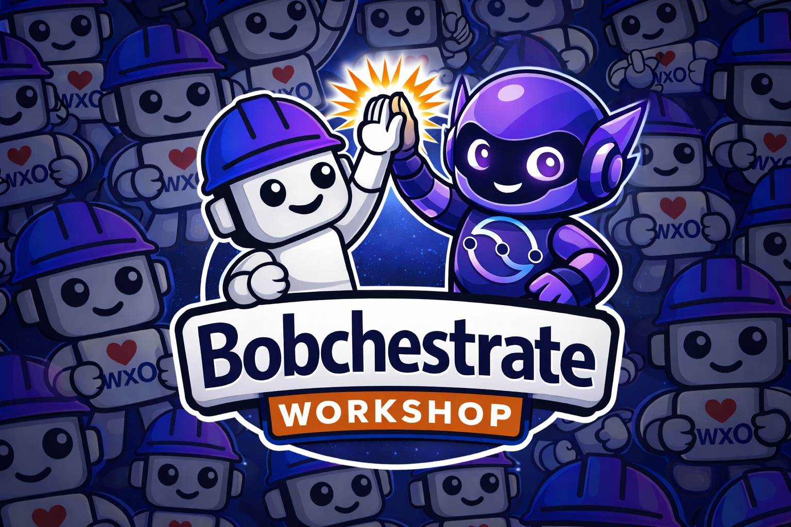

# Advanced Bobchestrate Workshop

<p align="center">
  
</p>

## Advanced Topics in watsonx Orchestrate Agent Development

Welcome to the advanced workshop. These modules assume you have a working watsonx Orchestrate SaaS environment and the ADK CLI configured.

---

## Prerequisites

Before starting any advanced part:

- ✅ wxO SaaS environment active and `orchestrate env list` shows your environment
- ✅ ADK CLI installed and up to date: `pip install --upgrade ibm-watsonx-orchestrate`
- ✅ Python 3.11–3.13 with `uv` installed
- ✅ IBM Bob IDE installed and open
- ✅ Comfortable with Python tools, agents, and the wxO ADK CLI

---

## Advanced Topics

| Part                                              | Topic                                                                           | Time       | Difficulty |
| ------------------------------------------------- | ------------------------------------------------------------------------------- | ---------- | ---------- |
| [1 — LangGraph Agents](part1-langgraph/README.md) | Build, package, and deploy custom LangGraph agents with memory and tool-calling | 60–75 min | ⭐⭐⭐     |
| 2 — Scheduling*(coming soon)*                  | Make agents and workflows run on a schedule via natural language                | 20 min     | ⭐         |
| 3 — Advanced Workflow Nodes*(coming soon)*     | Human-in-the-loop, Prompt nodes, Parallel execution, Doc Processing             | 30 min     | ⭐⭐       |
| 4 — LLM Model Policies*(coming soon)*          | Fallback, load-balancing, and retry across multiple LLM providers               | 25 min     | ⭐⭐       |
| 5 — Langflow Tools*(coming soon)*              | Build visual AI pipelines and import them as wxO tools                          | 30 min     | ⭐⭐       |
| 6 — CI/CD & GitOps*(coming soon)*              | Deploy agents through GitHub Actions using a GitOps pipeline                    | 40 min     | ⭐⭐       |

---

## How to use this workshop with Bob

Throughout the advanced modules, ask Bob for help:

```
"Bob, I'm building a LangGraph agent for wxO.
 Help me add a tool that calls the GitHub API using a wxO connection."
```

Bob knows the wxO ADK rules and the platform limitations. Ask it to explain concepts, generate code, debug errors, or suggest improvements.

---

## Getting Help

- Ask Bob: "Bob, I'm stuck on [specific issue]"
- [watsonx Orchestrate ADK Documentation](https://developer.watson-orchestrate.ibm.com/)
- [IBM watsonx Orchestrate docs](https://www.ibm.com/docs/en/watsonx/watson-orchestrate)
- [GitHub Issues](https://github.com/juseljuk/bobchestrate-workshop/issues)

---

Let's go! → [Advanced Part 1: LangGraph Agents](part1-langgraph/README.md)
