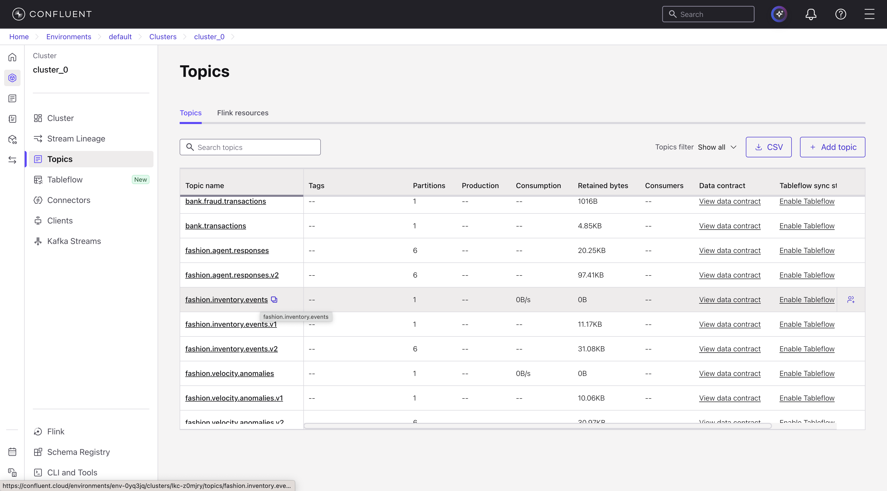
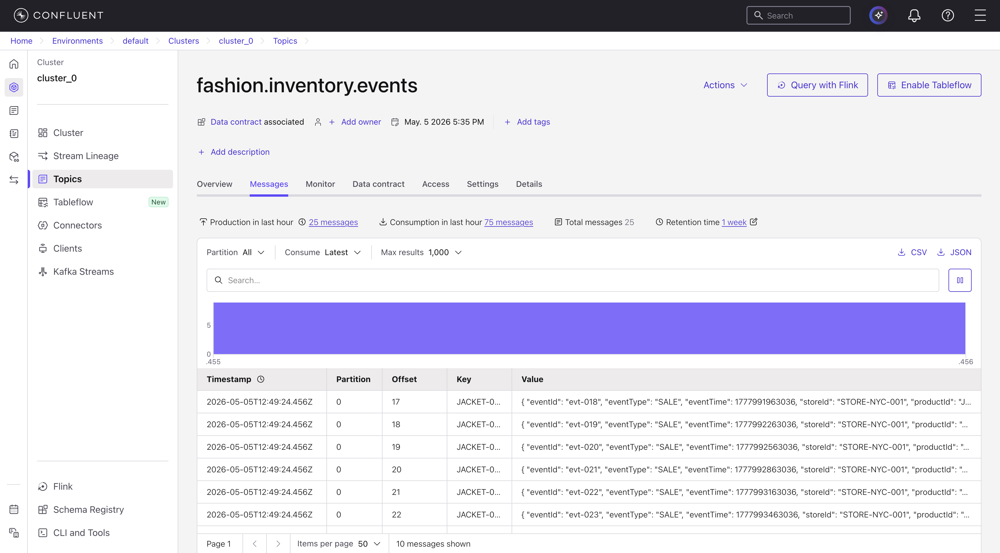
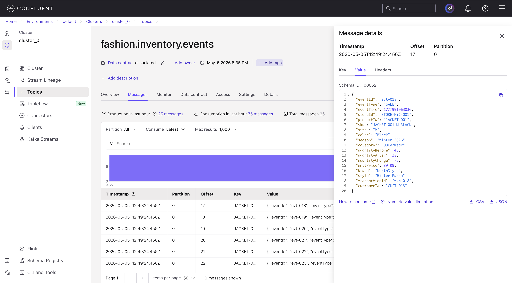
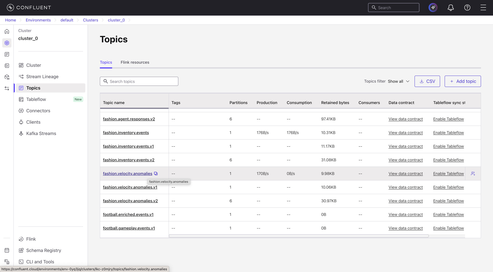
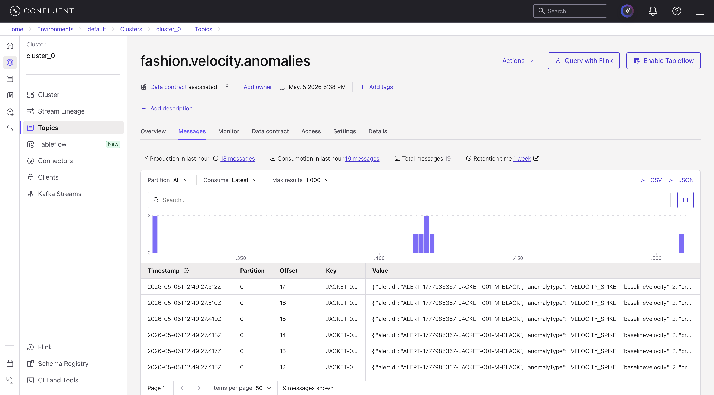
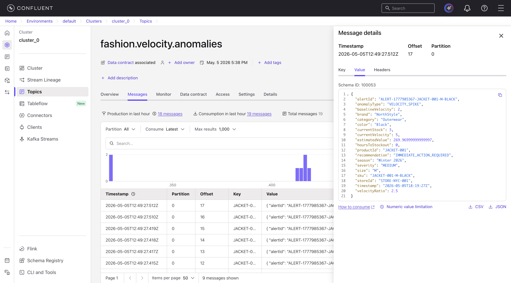

# Lab 2: Testing Inventory Velocity Scenarios

## Overview

In Lab 2, you will test the retail inventory velocity detection pipeline built in Lab 1 by sending realistic inventory event data and verifying that the system correctly identifies velocity spike scenarios.

This lab provides a complete walkthrough that results in:

- A configured Python environment connected to Confluent Cloud
- Test inventory events sent to the input topic with proper formatting
- Velocity alerts consumed and displayed from the output topic
- Verification that the detection logic works correctly

---

## Learning Objectives

By completing this lab, you will learn how to:

- Configure Python applications to connect to Confluent Cloud using API keys
- Send test inventory events with proper timestamp formatting to Kafka topics
- Consume and interpret velocity alerts from the results topic
- Analyze detection accuracy and system behavior

---

## Prerequisites

Before starting Lab 2, ensure you have completed:

- **[Lab 1](../lab1-confluent-setup/README.md)** - Confluent Cloud setup with running Flink query
- **Prerequisites from main README** - See [Prerequisites](../../../README.md#prerequisites) section for:
  - uv package manager installation
  - Git installation

> [!TIP]
> If you haven't installed uv yet, follow the [Installing uv](../../../README.md#installing-uv) instructions in the main README.

---

## Architecture Overview

This lab tests the inventory velocity detection pipeline built in Lab 1:

```
┌─────────────────────────────────────────────────────────────────┐
│                    Your Test Workflow                           │
│                                                                 │
│  1. Python Producer                                             │
│     └─> Sends test inventory events                             │
│         └─> fashion.inventory.events                            │
│                                                                 │
│  2. Flink SQL (already running)                                 │
│     └─> Detects velocity spikes                                 │
│         └─> fashion.velocity.anomalies                          │
│                                                                 │
│  3. Python Consumer                                             │
│     └─> Reads velocity alerts                                   │
│         └─> Displays results                                    │
└─────────────────────────────────────────────────────────────────┘
```

---

## Step 1: Environment Setup

> [!NOTE]
> If you've already completed the [Getting Started](../../../README.md#getting-started) section in the main README, you can skip to [Step 1.2](#12-configure-environment-variables).

### 1.1 Clone Repository and Install Dependencies

Follow the [Getting Started](../../../README.md#getting-started) instructions in the main README:

1. Clone the repository
2. Install dependencies with `uv sync --locked`

This will create a virtual environment and install all required dependencies.

---

### 1.2 Configure Environment Variables

1. Navigate to the `fashion-inventory-consumer` directory:
```bash
cd retail-inventory-optimization/fashion-inventory-consumer
```

2. Copy the example file:
```bash
cp .env.example .env
```

3. Edit `.env` with your credentials from Lab 1:

```bash
# Kafka Configuration
KAFKA_BOOTSTRAP_SERVERS=pkc-xxxxx.us-central1.gcp.confluent.cloud:9092
KAFKA_API_KEY=your_kafka_api_key_from_lab1
KAFKA_API_SECRET=your_kafka_api_secret_from_lab1
KAFKA_TOPIC=fashion.inventory.events
KAFKA_GROUP_ID=fashion-inventory-consumer-group
KAFKA_AUTO_OFFSET_RESET=earliest

# Schema Registry Configuration
SCHEMA_REGISTRY_URL=https://psrc-xxxxx.us-central1.gcp.confluent.cloud
SCHEMA_REGISTRY_API_KEY=your_schema_registry_key_from_lab1
SCHEMA_REGISTRY_API_SECRET=your_schema_registry_secret_from_lab1

# Result Configuration
RESULT_MODE=stdout
RESULT_TOPIC=fashion.velocity.anomalies
```

**Where to find each value:**
- `KAFKA_BOOTSTRAP_SERVERS`: [Lab 1 → Section 1.4 → Get Kafka Bootstrap Server](../lab1-confluent-setup/README.md#14-get-connection-endpoints)
- `KAFKA_API_KEY` & `KAFKA_API_SECRET`: [Lab 1 → Section 1.3 → Kafka API Key](../lab1-confluent-setup/README.md#13-create-api-keys)
- `SCHEMA_REGISTRY_URL`: [Lab 1 → Section 1.4 → Get Schema Registry URL](../lab1-confluent-setup/README.md#14-get-connection-endpoints)
- `SCHEMA_REGISTRY_API_KEY` & `SCHEMA_REGISTRY_API_SECRET`: [Lab 1 → Section 1.3 → Schema Registry API Key](../lab1-confluent-setup/README.md#13-create-api-keys)

---

## Step 2: Send Test Inventory Events

### 2.1 Understand Test Data

View the test data:
```bash
cat ../fashion-inventory-setup/data/test_winter_jacket_spike.csv
```

**Test scenarios included:**

| SKU | Scenario | Baseline | Spike | Ratio | Stock | Expected |
|------|----------|----------|-------|-------|-------|----------|
| JACKET-001-M-BLACK | Normal activity | 2/hr | 2/hr | 1x | 100 | No alert |
| JACKET-001-M-BLACK | Velocity spike | 2/hr | 25/hr | 12.5x | 75 | Alert |
| SWEATER-002-L-GRAY | Normal activity | 1/hr | 1/hr | 1x | 50 | No alert |

---

### 2.2 Start the Consumer

Run the consumer that will display alerts as they are received:

```bash
uv run consume_velocity_alerts.py
```

---

### 2.3 Send Test Events

Open a new terminal and run the producer:

```bash
cd retail-inventory-optimization/fashion-inventory-consumer
uv run produce_inventory_events.py --csv-file ../fashion-inventory-setup/data/test_winter_jacket_spike.csv
```

This script:
1. Reads the CSV file
2. Adjusts timestamps to current time (important for watermarks)
3. Serializes with Schema Registry
4. Sends to `fashion.inventory.events` topic

**Expected output:**
```
[1/25] Event: evt-001 | SKU: JACKET-001-M-BLACK | Qty: 100→99 | Store: STORE-NYC-001
✅ Sent successfully

...

[25/25] Event: evt-025 | SKU: SWEATER-002-L-GRAY | Qty: 50→49 | Store: STORE-NYC-001
✅ Sent successfully

========================================
✅ ALL MESSAGES SENT SUCCESSFULLY
========================================
Total messages: 25
Topic: fashion.inventory.events
```

---

### 2.4 Verify in Confluent Cloud UI

Confirm messages arrived in Kafka:

1. Go to Confluent Cloud → **Topics** → `fashion.inventory.events`

   

2. Click **"Messages"** tab


3. You should see 25 messages

   

4. Click on a message to view details:
   - Key: SKU-based key
   - Value: JSON with inventory event details
   - Timestamp: Recent (within last few minutes)

      

---

## Step 3: Verify Velocity Detection

### 3.1 Wait for Processing

⏱️ **Wait 2-3 minutes** for Flink to process events and generate alerts.

Monitor in Confluent Cloud:
1. Go to **Flink** → **Running statements**
2. Click on your velocity detection query
3. Check metrics:
   - Records in: Should show 25
   - Records out: Should show alerts (if velocity threshold met)

---

### 3.2 Review Consumer Output

Navigate back to your terminal where `consume_velocity_alerts.py` is running.

**Expected output:**
```
======== VELOCITY ALERT CONSUMER STARTED ========
Topic      : fashion.velocity.anomalies
Group ID   : velocity-alert-consumer-group
==============================================

🚨 VELOCITY SPIKE DETECTED | SKU: JACKET-001-M-BLACK | Store: STORE-NYC-001 | Velocity: 25.0 units/hr (12.5x baseline) | Stock: 75 units | Stockout in 3 hours

Waiting for more messages... (Press Ctrl+C to exit)
```

**Success criteria:**
- ✅ Velocity alerts for spike scenarios (JACKET-001-M-BLACK)
- ✅ Correct SKU and store information
- ✅ Accurate velocity and stockout calculations
- ✅ No alerts for normal activity (baseline scenarios)

Press `Ctrl+C` to stop the consumer.

---

### 3.3 Verify in Confluent Cloud

1. Go to **Topics** → `fashion.velocity.anomalies`

     

2. Click **"Messages"** tab
3. You should see velocity alert messages

     

4. Click on a message to view the alert details

     

---

## Expected Outcome

Upon successful completion of this lab, you will have:

**Environment Setup**
- Python environment configured with uv package manager
- Dependencies installed and ready to use
- Environment variables properly configured

**Test Data Sent**
- 25 inventory events across multiple SKUs
- Mix of normal and spike velocity patterns
- Proper timestamp formatting

**Velocity Detection Verified**
- Velocity alerts generated for spike scenarios
- No false positives on normal activity
- Accurate velocity and stockout calculations

**System Validated**
- Flink metrics showing healthy processing
- Schema validation working correctly
- End-to-end latency < 1 second

---

## Understanding the Results

### Why JACKET-001-M-BLACK Triggered Alerts

**JACKET-001-M-BLACK:**
- Large sale-driven inventory drop (25 units in 1 hour)
- Velocity: 25 units/hr vs baseline 2 units/hr
- Ratio: 12.5x (exceeds 3x threshold)
- Stock: 75 units remaining
- Stockout risk: 3 hours at current velocity
- Alert: CRITICAL severity, immediate action required

### Why Others Didn't Trigger Alerts

**SWEATER-002-L-GRAY:**
- Normal sales activity (1-2 units per hour)
- Velocity ratio: ~1x baseline
- Below velocity spike threshold
- No urgent stockout risk
- Result: No alert generated

---

## Troubleshooting

### No Velocity Alerts Received

**Possible causes:**
1. Flink query not running
2. Timestamps too old (outside watermark window)
3. Test data doesn't meet thresholds

**Solutions:**
- Check Flink query status in Confluent Cloud
- Resend with current timestamps: `uv run produce_inventory_events.py`
- Verify thresholds in SQL query (quantityChange >= 5)

### Connection Errors

**Error:** `Failed to connect to broker`

**Solutions:**
1. Check `.env` has correct `KAFKA_BOOTSTRAP_SERVERS`
2. Verify API keys are valid (not expired)
3. Check network connectivity to Confluent Cloud

### Schema Validation Errors

**Solutions:**
1. Verify using correct schema (`fashion.inventory.events-value`)
2. Check `eventTime` format is correct
3. Ensure all required fields are present

---

## Next Steps

**Ready for Part 2?** → [watsonx Orchestrate Agent Integration](../../part2-watsonx-orchestrate/README.md)

---

## 🔗 Resources

- [Confluent Python Client Docs](https://docs.confluent.io/kafka-clients/python/current/overview.html)
- [Schema Registry Serializers](https://docs.confluent.io/platform/current/schema-registry/serdes-develop/index.html)
- [Consumer App README](../../../fashion-inventory-consumer/README.md)
- [Complete Setup Guide](../../../fashion-inventory-setup/COMPLETE_SETUP_GUIDE.md)

---
