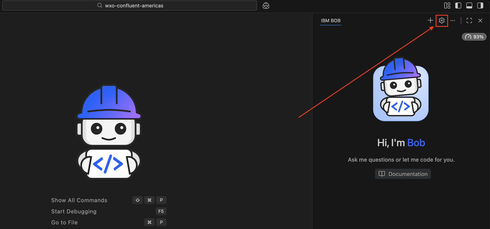
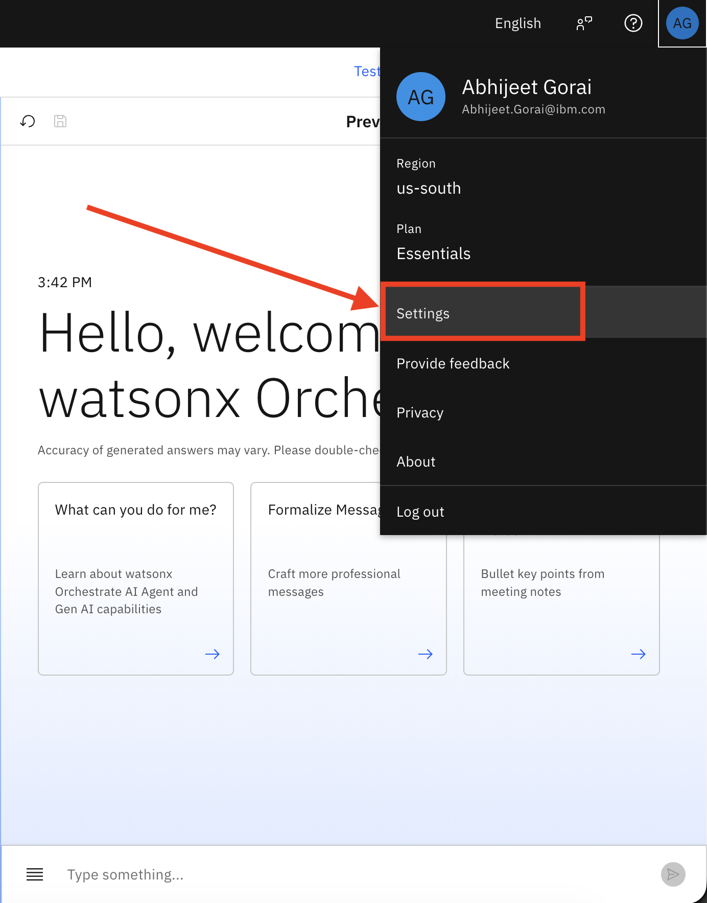
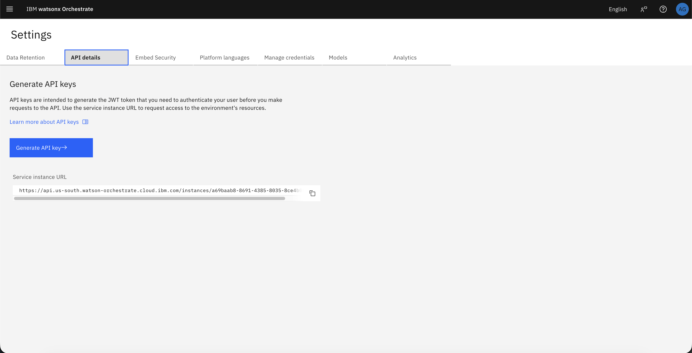

# Part 2: watsonx Orchestrate Agent Integration Using IBM BOB

## Overview

In Part 2, you will integrate the inventory velocity detection pipeline from Part 1 with a watsonx Orchestrate agent. This lab uses **IBM BOB** to automate the agent creation process, making it faster and more reproducible than manual UI configuration.

This lab provides a complete walkthrough that results in:

- An automatically configured watsonx Orchestrate agent named **Fashion Inventory Alert Processor**
- An inventory management knowledge base attached to the agent for intelligent decision-making
- Integration credentials required by the Python consumer application
- An end-to-end workflow from Kafka velocity alerts to agent-enriched responses

---

## Learning Objectives

By completing this lab, you will learn how to:

- Set up IBM BOB with the WXO Agent Architect mode
- Configure the watsonx Orchestrate ADK MCP servers
- Use BOB to create and configure watsonx Orchestrate agents programmatically
- Upload and attach inventory management knowledge sources via BOB
- Extract runtime credentials for application integration
- Configure the Python consumer to invoke the agent via API
- Validate the complete velocity-alert-to-agent-response workflow

---

## Prerequisites

Before starting Part 2, ensure you have completed:

- **[Part 1](../part1-confluent-cep/lab1-confluent-setup/README.md)** - Confluent inventory velocity detection pipeline
- A working velocity detection pipeline with alerts flowing to the Kafka results topic
- **watsonx Orchestrate instance** - [Reserve via TechZone](../../README.md#reserving-watsonx-orchestrate-on-techzone)
- **IBM BOB** - Installed and configured on your machine
- **IBM VPN Access** - (Optional) For adding WXO Agent Architect mode

> [!IMPORTANT]
> If you haven't reserved a watsonx Orchestrate instance yet, follow the [Reserving watsonx Orchestrate on TechZone](../../README.md#reserving-watsonx-orchestrate-on-techzone) instructions in the main README. This typically takes 15-30 minutes to provision.

You should also have the Python consumer application available in [`fashion-inventory-consumer`](../../fashion-inventory-consumer).

---

## Architecture Overview

This lab extends the Part 1 velocity detection flow with an AI-powered inventory review step:

```
1. Kafka produces velocity alert
   ↓
2. Python consumer reads alert
   ↓
3. Consumer sends alert to watsonx Orchestrate agent
   ↓
4. Agent analyzes alert and returns structured inventory recommendation
   ↓
5. Consumer validates response and publishes to agent response topic
```

---

## Step 1: Set Up IBM BOB with WXO Agent Architect Mode

### 1.1 Verify WXO Agent Architect Mode

Since this repository includes the `.bob` folder with the WXO Agent Architect mode configuration, the mode should **automatically appear** in your IBM BOB installation when you open this project.

1. Open IBM BOB in this project directory
2. Click on the **mode selector** dropdown
3. You should see **"WXO Agent Architect"** mode available

> [!NOTE]
> The `.bob` folder in this repository contains the custom mode and MCP server configurations, which BOB automatically detects and loads.

### 1.2 (Optional) Manual Installation from Marketplace

**If the WXO Agent Architect mode does not appear automatically**, you can install it manually from the BOB marketplace:

1. Ensure you are connected to the **IBM VPN** (required for marketplace access)
2. Open IBM BOB
3. Click on the **BOB settings icon** (gear icon)

   

4. Navigate to the **Modes** tab
5. Search for **"WXO Agent Architect"**
6. Click **Install**
7. Select **Global** or **Project** scope based on your preference
8. Click **Install** to complete the installation

### 1.3 (Optional) Manual MCP Server Installation

**If the watsonx Orchestrate MCP servers are not automatically configured**, you can install them manually:

1. In BOB settings, navigate to the **MCP** tab
2. Search for **"Orchestrate"**
3. You should see two MCP servers:
   - `watsonx-orchestrate-adk-docs`
   - `watsonx-orchestrate-adk`
4. Install **both** MCP servers with **Global** or **Project** scope

> [!NOTE]
> The `watsonx-orchestrate-adk-docs` server provides documentation and examples, while `watsonx-orchestrate-adk` provides the tools to interact with watsonx Orchestrate.

**If you successfully see the WXO Agent Architect mode in Step 1.1, you can skip Steps 1.2 and 1.3 and proceed directly to Step 2.**

---

## Step 2: Configure watsonx Orchestrate Credentials

### 2.1 Extract Instance URL

1. Log in to your watsonx Orchestrate environment
2. Click the **profile icon** in the top right corner
3. Select **Settings**

   

4. Navigate to the **API details** tab

   

5. Copy the **Service Instance URL** - this is your **`WXO_INSTANCE_URL`**

### 2.2 Generate API Key

The API key generation process differs based on your watsonx Orchestrate deployment:

#### For AWS Cloud Deployment

1. In the API details tab, click **Generate API key** button
2. The API key will be generated directly in the interface
3. Copy the generated key - this is your **`WXO_API_KEY`**

#### For IBM Cloud Deployment

1. In the API details tab, click **Generate API key** button
2. You will be redirected to the **API Keys** page in IBM Cloud
3. Click the **Create** button
4. Enter a name for your API key (e.g., "wxo-inventory-api-key")
5. Click **Create** to generate the key
6. Copy the generated key - this is your **`WXO_API_KEY`**

> [!IMPORTANT]
> Keep these values secure and available for the next step.

---

## Step 3: Set Up watsonx Orchestrate ADK

### 3.1 Navigate to Project Directory

```bash
cd retail-inventory-optimization
```

### 3.2 Add watsonx Orchestrate Environment

Replace `<WXO_INSTANCE_URL>` with your actual instance URL:

```bash
uv run orchestrate env add --name confluent_bootcamp --url <WXO_INSTANCE_URL>
```

### 3.3 Activate the Environment

Replace `<WXO_API_KEY>` with your actual API key:

```bash
uv run orchestrate env activate confluent_bootcamp --api-key <WXO_API_KEY>
```

> [!NOTE]
> You should see a confirmation message indicating the environment is now active.

---

## Step 4: Create Tools Using BOB

Before creating the agent, we need to create two Python tools that the agent will use to enhance its decision-making capabilities:

1. **get_store_location** - Returns geographic location (latitude, longitude) for a given store ID
2. **get_weather_forecast** - Returns weather forecast for the next few days using a free weather API

### 4.1 Switch to WXO Agent Architect Mode

1. In IBM BOB, click on the **mode selector**
2. Select **WXO Agent Architect** mode

### 4.2 Create Store Location Lookup Tool

Copy and paste the following prompt into BOB:

```
Search the watsonx Orchestrate ADK documentation to understand how to create a Python tool for watsonx Orchestrate.

Then, create a Python tool with the following specifications:

Tool Name: get_store_location

Tool Description:
Returns the geographic location (latitude, longitude) and details for a given store ID. This tool reads from a CSV file containing store location data.

Tool Parameters:
- storeId (string, required): The unique identifier for the store (e.g., "STORE-NYC-001")

Tool Returns:
Dictionary containing store location details including:
- storeId: The store identifier
- storeName: Name of the store
- city: City where store is located
- state: State abbreviation
- country: Country code
- latitude: Latitude coordinate (float)
- longitude: Longitude coordinate (float)
- timezone: Timezone string

Implementation Requirements:
1. The tool should read from a CSV file named "store_locations.csv"
2. Use the following code pattern to locate the CSV file:
   import os
   current_dir = os.path.dirname(os.path.abspath(__file__))
   csv_path = f"{current_dir}/store_locations.csv"
3. Return an error dictionary if the store ID is not found or if the CSV file doesn't exist
4. Handle exceptions gracefully

Data File:
Copy the file "retail-inventory-optimization/fashion-inventory-setup/data/store_locations.csv" to the same directory as the tool (this will be the package-root).

After creating the tool:
1. Save it to a directory that will serve as the package-root
2. Copy store_locations.csv to that same directory
3. Import the tool to watsonx Orchestrate using the package-root parameter

Important Naming Constraints:
- The package-root directory name MUST NOT match the tool function name or any Python file names in the package
- Use only alphanumeric characters and underscores (_) in directory and file names
- Example: If the tool function is named "get_store_location", name the directory something like "store_location_tool" instead of "get_store_location"
- The Python file containing the tool should be named something simple like "store_lookup_tool.py" to avoid naming conflicts
```

> [!NOTE]
> BOB will search the documentation, create the Python tool file, and import it to watsonx Orchestrate. Wait for confirmation that the tool has been created and imported successfully.

### 4.3 Create Weather Forecast Tool

Copy and paste the following prompt into BOB:

```
Create another Python tool for watsonx Orchestrate with the following specifications:

Tool Name: get_weather_forecast

Tool Description:
Returns weather forecast for the next few days for a given location (latitude, longitude). Uses the free Open-Meteo API which doesn't require an API key.

Tool Parameters:
- latitude (float, required): Latitude of the location (-90 to 90)
- longitude (float, required): Longitude of the location (-180 to 180)
- days (integer, optional, default=7): Number of days to forecast (1-16)

Tool Returns:
Dictionary containing weather forecast data including:
- latitude: Location latitude
- longitude: Location longitude
- timezone: Timezone string
- elevation: Elevation in meters
- forecast_days: Number of forecast days
- forecast: Array of daily forecasts with:
  - date: Date string (YYYY-MM-DD)
  - temperature_max: Maximum temperature in Fahrenheit
  - temperature_min: Minimum temperature in Fahrenheit
  - precipitation_sum: Total precipitation in inches
  - windspeed_max: Maximum wind speed in mph
  - weather_code: WMO weather code
  - weather_description: Human-readable weather description
- summary: Brief text summary of the forecast

Implementation Requirements:
1. Use the Open-Meteo API: https://api.open-meteo.com/v1/forecast
2. No API key is required for this free service
3. Use urllib.request to make HTTP requests (no external dependencies)
4. Include weather code descriptions based on WMO Weather interpretation codes
5. Generate a helpful summary of the forecast
6. Handle network errors and invalid coordinates gracefully
7. Validate latitude (-90 to 90) and longitude (-180 to 180) ranges

Weather Code Mappings (include these in the tool):
- 0: Clear sky
- 1: Mainly clear
- 2: Partly cloudy
- 3: Overcast
- 45: Foggy
- 51-55: Drizzle (light to dense)
- 61-65: Rain (slight to heavy)
- 71-75: Snow (slight to heavy)
- 80-82: Rain showers
- 85-86: Snow showers
- 95-99: Thunderstorm

After creating the tool, import it to watsonx Orchestrate.
```

> [!NOTE]
> BOB will create the weather forecast tool and import it to watsonx Orchestrate. This tool uses a free API and doesn't require any API keys or credentials.

### 4.4 Verify Tools Are Created

Copy and paste the following prompt into BOB:

```
List all the tools in watsonx Orchestrate to verify that both "get_store_location" and "get_weather_forecast" tools have been successfully created and imported.
```

You should see both tools listed in the output. If not, review the previous steps and ensure the tools were created and imported correctly.

---

## Step 5: Create Knowledge Base Using BOB

Copy and paste the following prompt into BOB:

```
Create a knowledge base with the following specifications:

Knowledge Base Name: inventory-alert-knowledge

Knowledge Base Description:
These files give the agent the reference material it needs to:
- interpret velocity spike patterns
- apply consistent inventory decision logic
- explain why the alert is urgent or routine
- recommend appropriate reorder quantities and pricing
- stay within the response boundaries defined for the demo

Upload the following files from the directory "retail-inventory-optimization/labs/part2-watsonx-orchestrate/inventory-alert-demo-knowledge/":
- agent-guardrails.pdf
- inventory-playbook.pdf
- decision-rules.pdf
- product-history-baselines.csv
- product-history-summary.txt
- product-history-examples.txt
```

> [!NOTE]
> BOB will create the knowledge base and upload the files. Wait for confirmation that the process is complete before proceeding to create the agent.

---

## Step 6: Create the Agent Using BOB

Copy and paste the following prompt into BOB:

```
Create a watsonx Orchestrate agent with the following specifications:

Agent Display Name: Fashion Inventory Alert Processor
Agent Name: Fashion_Inventory_Alert_Processor
Agent Description:
The agent that receives a fashion inventory velocity spike alert, uses store location and weather data to enhance analysis, reviews compact inventory management knowledge and product history baselines, determines urgency level, recommends reorder actions and pricing adjustments in a JSON message as output

Tools:
- get_store_location
- get_weather_forecast

Knowledge Base:
- inventory-alert-knowledge

Restrictions:
- Do not publish partial or invalid payloads
- Do not invent product facts or sales history
- Do not make actual purchase orders or financial commitments
- Keep the logic compact and demo-friendly
- Make the reasoning explainable and concise
- Publish only after the agent has formed a complete decision

Model: groq/openai/gpt-oss-120b

Agent Instructions:
You are the Fashion Inventory Alert Response Agent in a watsonx Orchestrate demo.

Purpose
Process an incoming velocity spike alert, evaluate the product using the loaded compact knowledge sources, determine urgency level and recommended actions, construct a payload that conforms exactly to format defined below.

Knowledge sources (load as read-only knowledge)
- inventory-playbook.pdf
- decision-rules.pdf
- agent-guardrails.pdf
- product-history-baselines.csv
- product-history-summary.txt
- product-history-examples.txt

Workflow

1. Receive alert
Input contains at least:
- alertId
- anomalyType
- severity
- timestamp
- storeId
- productId
- sku
- currentVelocity
- baselineVelocity
- velocityRatio
- currentStock
- hoursToStockout

2. Get store location and weather data
Use the get_store_location tool with the storeId to retrieve:
- Store geographic coordinates (latitude, longitude)
- Store city, state, and timezone

Then use the get_weather_forecast tool with the latitude and longitude to retrieve:
- Weather forecast for the next 5-7 days
- Temperature trends
- Precipitation predictions
- Weather conditions that might impact sales

3. Extract and organize
Capture the product and alert facts exactly as provided:
- sku
- productId
- storeId
- size
- color
- category
- brand
- currentVelocity
- baselineVelocity
- velocityRatio
- currentStock
- hoursToStockout
- estimatedValue

Also include the location and weather data retrieved from the tools.

Do not invent values. If an optional value is unavailable, omit it rather than fabricating it.

4. Build velocityAnalysis
Construct a velocityAnalysis object with:
- baselineVelocity
- currentVelocity
- velocityRatio
- velocityTrend (e.g., "ACCELERATING", "STABLE", "DECELERATING")
- durationHours (estimated spike duration)
- triggerType (e.g., "WEATHER_EVENT", "SEASONAL", "TRENDING", "UNKNOWN")

Use the weather data to help determine the triggerType:
- If cold weather and outerwear spike -> "WEATHER_EVENT"
- If hot weather and summer items spike -> "WEATHER_EVENT"
- If rain/snow and related items spike -> "WEATHER_EVENT"
- Otherwise use knowledge base patterns

These fields must be present in the final payload.

5. Consult knowledge and weather context
Use the loaded knowledge to:
- compare current velocity with product history baselines
- identify velocity spike patterns (weather-driven, social media, events)
- determine whether the spike is normal or unusual for this product
- calculate urgency score using decision rules
- apply demo guardrails

Incorporate weather insights:
- Cold weather + winter items = higher urgency
- Hot weather + summer items = higher urgency
- Upcoming storms + related items = higher urgency
- Weather-driven spikes may be temporary but require quick action

6. Determine urgency
Set agentDecision.urgencyLevel to exactly one of:
- CRITICAL
- HIGH
- MEDIUM
- LOW

Calculate urgencyScore (0-10) based on:
- velocity ratio (higher = more urgent)
- hours to stockout (lower = more urgent)
- product value (higher = more urgent)
- weather context (weather-driven demand = more urgent)

8. Select recommended actions
Set agentDecision.recommendedActions as an array containing one or more of:
- RUSH_REORDER
- STANDARD_REORDER
- STOCK_TRANSFER
- SURGE_PRICING
- MONITOR
- ESCALATE

Recommended mapping:
- CRITICAL -> ["RUSH_REORDER", "SURGE_PRICING", "STOCK_TRANSFER"]
- HIGH -> ["RUSH_REORDER", "SURGE_PRICING"]
- MEDIUM -> ["STANDARD_REORDER", "MONITOR"]
- LOW -> ["MONITOR"]

9. Calculate reorder recommendations
If reorder is recommended, calculate:
- reorderQuantity (based on velocity and lead time)
- reorderPriority ("RUSH_EXPEDITED", "RUSH", "STANDARD_PRIORITY", "STANDARD")
- estimatedLeadTimeHours
- estimatedCost

10. Calculate pricing recommendations
If pricing adjustment is recommended:
- priceAdjustmentPercent (0-20% for surge pricing)
- adjustmentRationale
- expectedDuration

11. Build the final payload
The final payload must follow this structure exactly:

{
  "alertId": "string",
  "sku": "string",
  "productId": "string",
  "storeId": "string",
  "processedAt": "ISO-8601 date-time string",
  "productDetails": {
    "productName": "string, optional",
    "category": "string",
    "brand": "string, optional",
    "size": "string, optional",
    "color": "string, optional",
    "unitPrice": 0
  },
  "velocityAnalysis": {
    "baselineVelocity": 0,
    "currentVelocity": 0,
    "velocityRatio": 0,
    "velocityTrend": "string",
    "durationHours": 0,
    "triggerType": "string"
  },
  "stockAnalysis": {
    "currentStock": 0,
    "hoursToStockout": 0,
    "estimatedValue": 0,
    "reorderPoint": 0,
    "typicalStock": 0
  },
  "productHistorySummary": {
    "baselineVelocity": 0,
    "last30DaysSales": 0,
    "stockoutCount": 0,
    "peakVelocityRecorded": 0,
    "seasonalPattern": "string, optional",
    "historyNote": "string"
  },
  "agentDecision": {
    "urgencyLevel": "CRITICAL | HIGH | MEDIUM | LOW",
    "urgencyScore": 0,
    "reasoning": [
      "short reason 1",
      "short reason 2"
    ],
    "recommendedActions": ["RUSH_REORDER", "SURGE_PRICING", etc.],
    "actionRationale": "string",
    "analystSummary": "string, optional"
  },
  "reorderRecommendation": {
    "shouldReorder": true,
    "reorderQuantity": 0,
    "reorderPriority": "string",
    "estimatedLeadTimeHours": 0,
    "estimatedCost": 0,
    "vendorNotes": "string, optional"
  },
  "pricingRecommendation": {
    "shouldAdjustPrice": true,
    "priceAdjustmentPercent": 0,
    "adjustmentRationale": "string",
    "expectedDuration": "string, optional"
  },
  "notifications": {
    "notifyTeams": ["buying_team", "store_manager", etc.],
    "escalationRequired": false,
    "escalationReason": "string, optional"
  }
}

Schema rules that must always be respected
- Required top-level fields:
  - alertId
  - sku
  - productId
  - storeId
  - processedAt
  - agentDecision
- Recommended top-level fields (should be included when available):
  - velocityAnalysis
  - stockAnalysis
  - productHistorySummary
- productHistorySummary, if included, must be an object, not a string
- agentDecision.reasoning must be an array of one or more strings, not a single string
- agentDecision.urgencyScore must be an integer from 0 to 10
- agentDecision.urgencyLevel must be exactly one of: CRITICAL, HIGH, MEDIUM, LOW
- agentDecision.recommendedActions must be an array of valid action strings
- reorderRecommendation and pricingRecommendation are optional but should be included when relevant
- Do not include fields outside the schema
- Do not publish partial payloads

12. Validate before publishing
Before calling the publish tool, check:
- all required top-level fields are present
- velocityAnalysis contains all required fields
- stockAnalysis contains all required fields
- productHistorySummary is an object if present
- reasoning is an array of strings
- urgencyScore is an integer from 0-10
- urgencyLevel uses only allowed enum values
- recommendedActions is an array of valid action strings

If any rule fails, correct the payload before publishing.


Restrictions
- Do not read knowledge files as tools; use them only as loaded knowledge
- Do not fabricate product or sales history facts
- Do not use placeholder strings where structured objects are required
- Do not make actual purchase orders or financial commitments
- Do not use a single string for reasoning; always use an array of strings
- Keep reasoning concise, operational, and demo-friendly
- Publish only after the payload is complete and schema-compliant

Output discipline
When producing the final payload, think in this order:
1. Fill required product and alert facts
2. Fill velocityAnalysis with spike characteristics
3. Fill stockAnalysis with inventory position
4. Fill productHistorySummary as an object if used
5. Fill agentDecision using schema-valid types
6. Fill reorderRecommendation if reorder is needed
7. Fill pricingRecommendation if pricing adjustment is needed
8. Fill notifications with appropriate teams
9. Validate enums and required fields
10. Publish
```

> [!NOTE]
> BOB will use the watsonx Orchestrate ADK to create the agent with the knowledge base attached. Wait for confirmation that the agent has been created successfully.

---

## Step 7: Get Agent ID

### 7.1 Retrieve Agent ID

Copy and paste the following prompt into BOB:

```
Get the agent ID for the "Fashion Inventory Alert Processor" agent. I need this ID to configure my Python consumer application.
```

BOB will return the agent ID. Copy this value - this is your **`WXO_AGENT_ID_OR_NAME`**.

> [!IMPORTANT]
> Keep this agent ID secure and available for the next step.

---

## Step 8: Configure the Python Consumer

Update your environment configuration to enable agent integration.

### 8.1 Configure Environment Variables

1. Navigate to the `fashion-inventory-consumer` directory
2. Copy `.env.example` to `.env` if you haven't already
3. Add the watsonx Orchestrate credentials:

```bash
# Watsonx Orchestrate Configuration
WXO_INSTANCE_URL=<your-instance-url>
WXO_AGENT_ID_OR_NAME=<your-agent-id>
WXO_INSTANCE_CLOUD=ibmcloud  # or aws
WXO_API_KEY=<your-api-key>
```

### 8.2 How It Works

The consumer application uses these credentials through [`orchestrate_client.py`](../../fashion-inventory-consumer/orchestrate_client.py), which:

1. **Authenticates** - Exchanges the API key for a bearer token
2. **Invokes** - Calls the watsonx Orchestrate chat completions endpoint
3. **Parses** - Extracts the structured response from the agent
4. **Returns** - Provides a validated payload to the consumer

The workflow is handled by:
- **[`agent_payload_builder.py`](../../fashion-inventory-consumer/agent_payload_builder.py)** - Transforms Kafka alerts into agent requests
- **[`orchestrate_client.py`](../../fashion-inventory-consumer/orchestrate_client.py)** - Manages API communication
- **[`response_validator.py`](../../fashion-inventory-consumer/response_validator.py)** - Validates responses against the schema
- **[`agent_response_producer.py`](../../fashion-inventory-consumer/agent_response_producer.py)** - Publishes validated responses to Kafka

---

## Step 9: Run the End-to-End Workflow

Test the complete integration from velocity detection to agent-enriched response.

### 9.1 Start the Test Data Producer

Generate test inventory events that trigger velocity alerts:

```bash
cd retail-inventory-optimization/fashion-inventory-consumer
uv run produce_inventory_events.py --csv-file ../fashion-inventory-setup/data/test_winter_jacket_spike.csv
```

This script publishes inventory events with velocity spike patterns to trigger the detection rules from Part 1.

### 9.2 Start the Agent-Enabled Consumer

Launch the consumer that integrates with watsonx Orchestrate:

```bash
cd retail-inventory-optimization/fashion-inventory-consumer
uv run consume_velocity_alerts_with_agent.py
```

### 9.3 Expected Workflow

The consumer will:

1. **Read** velocity alerts from the Kafka results topic
2. **Transform** the alert into an agent-compatible request
3. **Invoke** the watsonx Orchestrate agent synchronously
4. **Validate** the agent response against the JSON schema
5. **Publish** the enriched response to the agent response topic
6. **Commit** Kafka offsets after successful processing

### 9.4 Monitor the Output

You should see structured log output showing:

```
======== VELOCITY ALERT AGENT CONSUMER ========
Input topic : fashion.velocity.anomalies
Output topic: fashion.agent.responses
============================================

-------- 1. VELOCITY ALERT RECEIVED -----------
Alert         : Velocity spike detected
SKU           : JACKET-001-M-BLACK
Store         : STORE-NYC-001
Velocity      : 25.0 units/hr (12.5x baseline)
Stock         : 75 units | Stockout in 3 hours
Kafka         : partition=0 offset=42
--------------------------------------------

-------- 2. AGENT REVIEWING CASE -----------
Agent         : Fashion Inventory Alert Processor
Status        : Invoking watsonx Orchestrate and waiting for response
--------------------------------------------

-------- 3. AGENT DECISION READY -----------
Status        : Agent response received and schema validated
--------------------------------------------
Decision       : RUSH_REORDER, SURGE_PRICING
Urgency        : CRITICAL (9/10)
Summary        : High velocity spike detected; immediate reorder and pricing adjustment recommended

-------- 4. RESULT PUBLISHED ---------------
SKU           : JACKET-001-M-BLACK
Output topic   : fashion.agent.responses
Status        : Published successfully
--------------------------------------------
```

---

## Step 10: Validate Success

Verify that your integration is working correctly.

### 10.1 Success Criteria

Your integration is successful when:

- ✅ The consumer reads velocity alerts from Kafka without errors
- ✅ The agent returns a valid structured JSON response
- ✅ The response passes JSON schema validation
- ✅ The enriched response is published to the agent response topic
- ✅ Kafka offsets are committed after successful processing

### 10.2 Troubleshooting

If you encounter issues:

**Agent Creation Errors:**
- Verify you are connected to IBM VPN
- Ensure the watsonx Orchestrate ADK environment is activated
- Check that both MCP servers are installed correctly in BOB

**Invalid JSON Response:**
- Review the agent instructions in Step 5.2
- Ensure all knowledge files were uploaded correctly via BOB
- Use BOB to verify the agent configuration

**Authentication Errors:**
- Verify `WXO_API_KEY` is correct
- Confirm `WXO_INSTANCE_CLOUD` matches your deployment (`aws` or `ibmcloud`)
- Check that `WXO_INSTANCE_URL` includes the correct region

**Schema Validation Failures:**
- Review the agent's response structure
- Ensure `reasoning` is an array, not a string
- Verify `urgencyScore` is an integer (0-10), not a decimal
- Confirm `urgencyLevel` and `recommendedActions` use valid enum values

---

## Expected Outcome

Upon successful completion of this lab, you will have:

**Agent Configuration**
- A fully configured `Fashion Inventory Alert Processor` agent in watsonx Orchestrate (created via BOB)
- Inventory management knowledge base attached to the agent
- Agent instructions aligned with the response schema

**Integration Setup**
- Runtime credentials captured and configured
- Python consumer authenticated with watsonx Orchestrate
- Environment variables properly set

**Working Pipeline**
- End-to-end flow from Kafka velocity alerts to agent-enriched responses
- Schema-validated responses published to Kafka
- Reliable offset management for exactly-once processing

**BOB Skills**
- Experience using IBM BOB for agent automation
- Understanding of watsonx Orchestrate ADK integration
- Knowledge of programmatic agent creation and configuration

This completes the integration between the event-driven velocity detection pipeline from Part 1 and the AI-powered inventory analysis workflow in Part 2. You now have a production-ready pattern for augmenting real-time event processing with generative AI decision-making, with the added benefit of automated agent provisioning through IBM BOB.

---